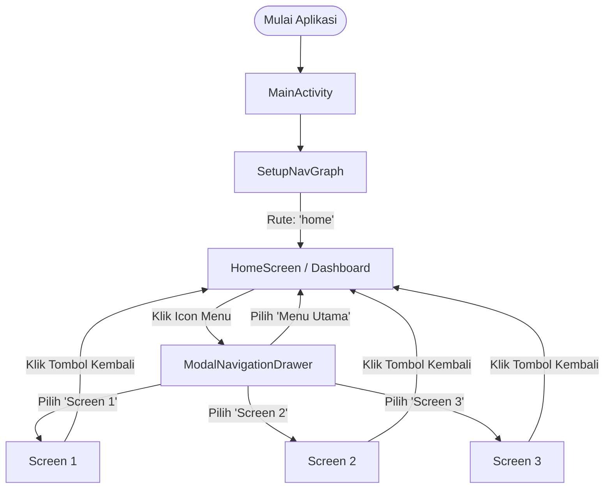

# 📱 Praktikum Navigation Drawer (Jetpack Compose)

Proyek ini adalah aplikasi Android modern berbasis **Jetpack Compose** dan **Material 3** yang diimplementasikan untuk memenuhi tugas praktikum pemrograman perangkat bergerak (Semester 6). Aplikasi ini fokus pada demonstrasi penggunaan **Navigation Drawer** (laci navigasi) dengan navigasi multi-halaman (multi-screen navigation) serta komponen visual interaktif.

---

## 🛠️ Tech Stack & Badges

Berikut adalah teknologi dan pustaka utama yang digunakan dalam proyek ini:

---

## 🗺️ Alur Navigasi & Arsitektur Aplikasi

Aplikasi ini menggunakan **Jetpack Navigation Component** untuk mengatur alur perpindahan antar halaman. Berikut adalah diagram alur navigasi aplikasi:

---

## 🎨 Detail & Fitur Seluruh Aplikasi

Aplikasi ini memiliki fitur lengkap yang dirancang secara visual menggunakan tema modern dan komponen-komponen terstruktur:

### 1. 🗂️ Sistem Navigasi Drawer (`DrawerContent.kt`)
Komponen laci samping (`ModalNavigationDrawer` & `ModalDrawerSheet`) yang dapat ditarik dari sisi kiri layar atau dibuka melalui ikon menu pada Top Bar.
*   **🌈 Header Drawer dengan Gradien**:
    - Memiliki latar belakang gradien vertikal dari `PrimaryDark` (`#0D47A1`) ke `Primary` (`#1565C0`).
    - Tinggi header `200.dp` dengan padding `24.dp`.
    - Dilengkapi avatar melingkar (`CircleShape`) menggunakan ikon **👤 Person** dengan transparansi putih (`Color.White.copy(alpha = 0.2f)`).
    - Menampilkan informasi profil pengguna: Nama jabatan (**"Android Developer"**) dan email (**"developer@example.com"**).
*   **📋 Daftar Menu Navigasi**:
    - **🏠 Menu Utama**: Rute `home` (Ikon `Home` - Masuk ke Dashboard).
    - **❤️ Screen 1**: Rute `screen_1` (Ikon `Favorite`).
    - **🔔 Screen 2**: Rute `screen_2` (Ikon `Notifications`).
    - **⚙️ Screen 3**: Rute `screen_3` (Ikon `Settings`).
*   **✨ Efek Seleksi & Fokus**:
    - Item menu yang aktif disorot dengan latar belakang biru muda (`#E3F2FD`) dan teks tebal berwarna biru (`#1565C0`).
    - Item menu yang tidak aktif menggunakan teks abu-abu (`Color.Gray`) dengan latar belakang transparan.
    - Ujung-ujung item menu menggunakan bentuk melengkung (`RoundedCornerShape(16.dp)`).
*   **🏷️ Footer**:
    - Menampilkan teks versi aplikasi `"Version 1.0.0"` di bagian paling bawah laci navigasi.

### 2. 📊 Halaman Dashboard Utama (`HomeScreen.kt`)
Merupakan halaman utama aplikasi (start destination) yang berisi ringkasan informasi dan aksi cepat:
*   **🔝 TopAppBar Gradien**:
    - Menggunakan gradien horizontal dari `PrimaryDark` ke `Primary`.
    - Judul bertuliskan **"Dashboard"** dengan teks putih tebal.
    - Tombol navigasi menu di sebelah kiri untuk membuka drawer.
    - Bayangan elevasi `4.dp` menggunakan komponen `Surface` untuk efek kedalaman.
*   **👋 Welcome Banner (Banner Sambutan)**:
    - Kartu (`Card`) melengkung (`RoundedCornerShape(20.dp)`) berwarna biru primer (`Primary`).
    - Teks sambutan personal: `"Hello, Muhammad Rafli Adyatma"` dengan subteks `"Have a great day today."`.
    - Ikon lambaian tangan (**WavingHand**) dengan aksen melingkar transparan di sebelah kanan.
    - Dilengkapi efek bayangan (`defaultElevation = 6.dp`).
*   **⚡ Quick Actions (Aksi Cepat - Grid 2 Kolom)**:
    - Grid interaktif 2 kolom yang membagi tombol aksi secara merata di layar.
    - Masing-masing kartu menggunakan latar belakang putih bersih (`Color.White`), elevasi `2.dp`, dan sudut melengkung `16.dp`.
    - Terdiri dari 4 menu aksi cepat:
      1.  **👤 Profile** (Ikon `Person`, aksen warna biru)
      2.  **❤️ Favorites** (Ikon `Favorite`, aksen warna merah muda `#E91E63`)
      3.  **📈 Stats** (Ikon `BarChart`, aksen warna hijau `#4CAF50`)
      4.  **⚙️ Settings** (Ikon `Settings`, aksen warna oranye `#FFFF9800`)
*   **🕒 Recent Activity (Aktivitas Terbaru)**:
    - Daftar vertikal (`LazyColumn`) yang menampilkan riwayat notifikasi terbaru pengguna.
    - Terdiri dari 5 item dinamis: "Activity Notification #1" hingga "#5".
    - Setiap item memiliki ikon riwayat (`History`) berwarna abu-abu dengan latar kotak ber-radius `8.dp`, penunjuk waktu ("2 hours ago"), dan elevasi halus `1.dp`.

### 3. 🖥️ Template Halaman Pendukung (`ScreenContent.kt`)
Sebuah komponen kontainer reusable yang mempermudah pembuatan sub-halaman baru dengan visual yang seragam:
*   **🔙 TopAppBar Integrasi Navigasi Balik**:
    - Menampilkan judul halaman dinamis sesuai dengan halaman yang sedang diakses (*Screen 1*, *Screen 2*, atau *Screen 3*).
    - Tombol kembali (Back Arrow) di sebelah kiri yang langsung terhubung ke sistem penumpukan navigasi (`navController.popBackStack()`).
    - Memiliki gradien warna latar belakang yang sama dengan halaman utama untuk konsistensi UI.
    - Elevasi lebih tegas (`8.dp`).
*   **📦 Body Container**:
    - Area konten berlatar abu-abu terang (`#F8F9FA`) yang siap diisi dengan composable kustom pada masing-masing sub-layar.

### 4. 📄 Sub-Halaman (`Screen1.kt`, `Screen2.kt`, `Screen3.kt`)
Halaman tujuan yang diakses dari laci navigasi:
*   **❤️ Screen 1**: Menampilkan halaman dengan judul "Screen 1" menggunakan template `ScreenContent`.
*   **🔔 Screen 2**: Menampilkan halaman dengan judul "Screen 2" menggunakan template `ScreenContent`.
*   **⚙️ Screen 3**: Menampilkan halaman dengan judul "Screen 3" menggunakan template `ScreenContent`.
*   Seluruh sub-halaman ini otomatis mendukung fungsi tombol kembali fisik android maupun tombol kembali pada Top Bar untuk kembali ke Dashboard.

### 5. 🎨 Edge-to-Edge & Tema Aplikasi (`Theme.kt`, `Color.kt`)
*   **📱 Edge-to-Edge**: Diaktifkan di `MainActivity` melalui `enableEdgeToEdge()` agar konten aplikasi digambar penuh di bawah status bar dan navigation bar sistem operasi Android.
*   **🎨 Tema Warna Kustom**:
    - `Primary` (`#1565C0` - Biru Medium)
    - `PrimaryDark` (`#0D47A1` - Biru Tua)
    - `DrawerItemSelected` (`#E3F2FD` - Biru Muda Soft untuk latar menu aktif)
    - `BackgroundMain` & `BackgroundDrawer` untuk memisahkan warna latar belakang aplikasi.

---

## 🛠️ Ringkasan Struktur Berkas & Jalur Kode

Berikut adalah pemetaan berkas kode sumber penting yang mengimplementasikan fitur-fitur di atas:

| Nama Komponen / Berkas | Jalur Berkas | Deskripsi Detail |
| :--- | :--- | :--- |
| **MainActivity** | [`MainActivity.kt`](file:///E:/Lainnya/Tugas/Semester%206/Pemrograman%20Mobile/Project/PraktikumNavigationDrawer/app/src/main/java/com/example/praktikumnavigationdrawer/MainActivity.kt) | Menginisialisasi tema dan pengontrol navigasi utama. |
| **NavGraph** | [`NavGraph.kt`](file:///E:/Lainnya/Tugas/Semester%206/Pemrograman%20Mobile/Project/PraktikumNavigationDrawer/app/src/main/java/com/example/praktikumnavigationdrawer/ui/navigation/NavGraph.kt) | Menghubungkan rute-rute dengan class Composable terkait. |
| **Navigation Routes** | [`NavigationRoutes.kt`](file:///E:/Lainnya/Tugas/Semester%206/Pemrograman%20Mobile/Project/PraktikumNavigationDrawer/app/src/main/java/com/example/praktikumnavigationdrawer/ui/navigation/NavigationRoutes.kt) | Menyimpan definisi rute aman bertipe (*Sealed Class*). |
| **Drawer Layout** | [`DrawerContent.kt`](file:///E:/Lainnya/Tugas/Semester%206/Pemrograman%20Mobile/Project/PraktikumNavigationDrawer/app/src/main/components/DrawerContent.kt) | Mengatur tata letak visual laci samping (Header gradien & item menu). |
| **HomeScreen** | [`HomeScreen.kt`](file:///E:/Lainnya/Tugas/Semester%206/Pemrograman%20Mobile/Project/PraktikumNavigationDrawer/app/src/main/java/com/example/praktikumnavigationdrawer/ui/screens/HomeScreen.kt) | Menyusun tata letak Dashboard utama (Welcome banner, quick action, list). |
| **Screen Content Template** | [`ScreenContent.kt`](file:///E:/Lainnya/Tugas/Semester%206/Pemrograman%20Mobile/Project/PraktikumNavigationDrawer/app/src/main/java/com/example/praktikumnavigationdrawer/ui/screens/ScreenContent.kt) | Template visual standar untuk Screen 1, 2, dan 3. |
| **Sub Screen 1** | [`Screen1.kt`](file:///E:/Lainnya/Tugas/Semester%206/Pemrograman%20Mobile/Project/PraktikumNavigationDrawer/app/src/main/java/com/example/praktikumnavigationdrawer/ui/screens/Screen1.kt) | Mengimplementasikan tampilan untuk Screen 1. |
| **Sub Screen 2** | [`Screen2.kt`](file:///E:/Lainnya/Tugas/Semester%206/Pemrograman%20Mobile/Project/PraktikumNavigationDrawer/app/src/main/java/com/example/praktikumnavigationdrawer/ui/screens/Screen2.kt) | Mengimplementasikan tampilan untuk Screen 2. |
| **Sub Screen 3** | [`Screen3.kt`](file:///E:/Lainnya/Tugas/Semester%206/Pemrograman%20Mobile/Project/PraktikumNavigationDrawer/app/src/main/java/com/example/praktikumnavigationdrawer/ui/screens/Screen3.kt) | Mengimplementasikan tampilan untuk Screen 3. |
| **Color Palettes** | [`Color.kt`](file:///E:/Lainnya/Tugas/Semester%206/Pemrograman%20Mobile/Project/PraktikumNavigationDrawer/app/src/main/java/com/example/praktikumnavigationdrawer/ui/theme/Color.kt) | Pengaturan variabel warna heksadesimal Compose. |

---

## 🚀 Cara Menjalankan Proyek

1. **🚀 Persiapan**:
   - Pasang [Android Studio](https://developer.android.com/studio) versi terbaru.
   - Pastikan Gradle menggunakan JDK versi 17 atau di atasnya.
2. **📂 Kloning & Impor**:
   - Unduh atau kloning repositori ini.
   - Buka Android Studio, klik **File** -> **Open**, lalu pilih direktori proyek `PraktikumNavigationDrawer`.
   - Biarkan Gradle mengunduh dependensi awal (*syncing*).
3. **📲 Menjalankan Aplikasi**:
   - Aktifkan USB Debugging di ponsel Android Anda dan sambungkan ke PC, atau buat Emulator baru lewat Device Manager di Android Studio.
   - Klik tombol **Run** (ikon segitiga hijau) pada bilah alat atas.

---

## 👤 Informasi Mahasiswa
*   **Nama Lengkap**: Muhammad Rafli Adyatma
*   **Mata Kuliah**: Pemrograman Mobile
*   **Semester**: 6
*   **Tugas Praktikum**: Pembuatan Antarmuka Berbasis Laci Navigasi (Navigation Drawer) dengan Jetpack Compose
