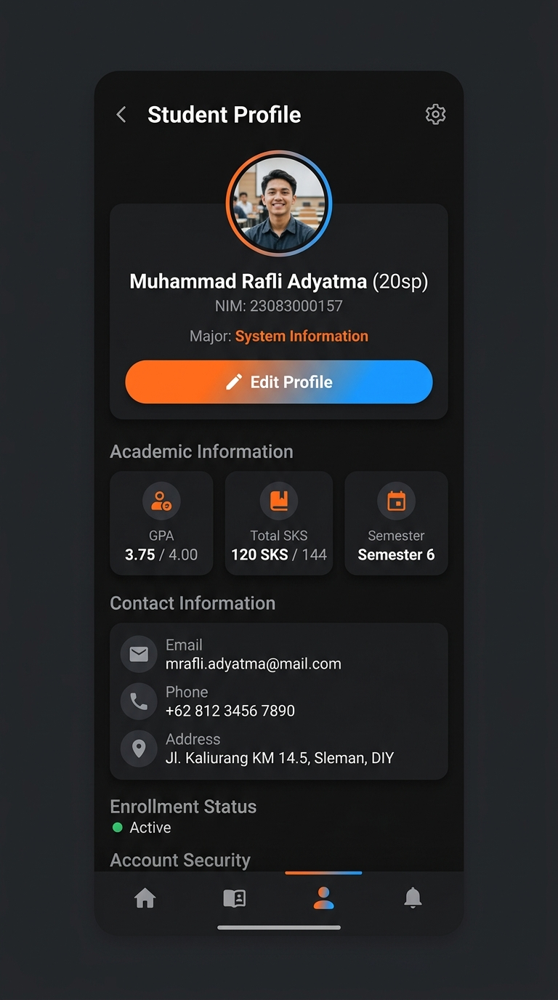
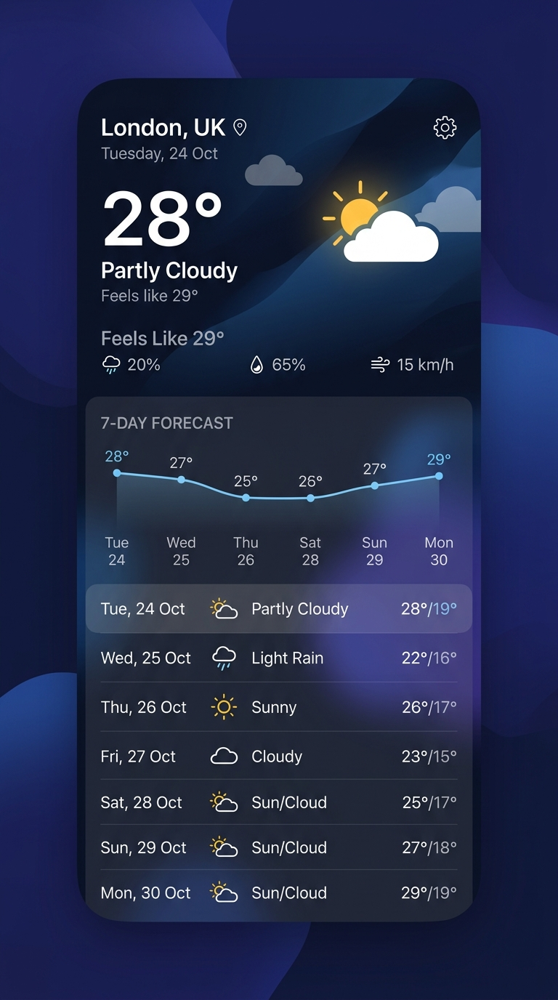
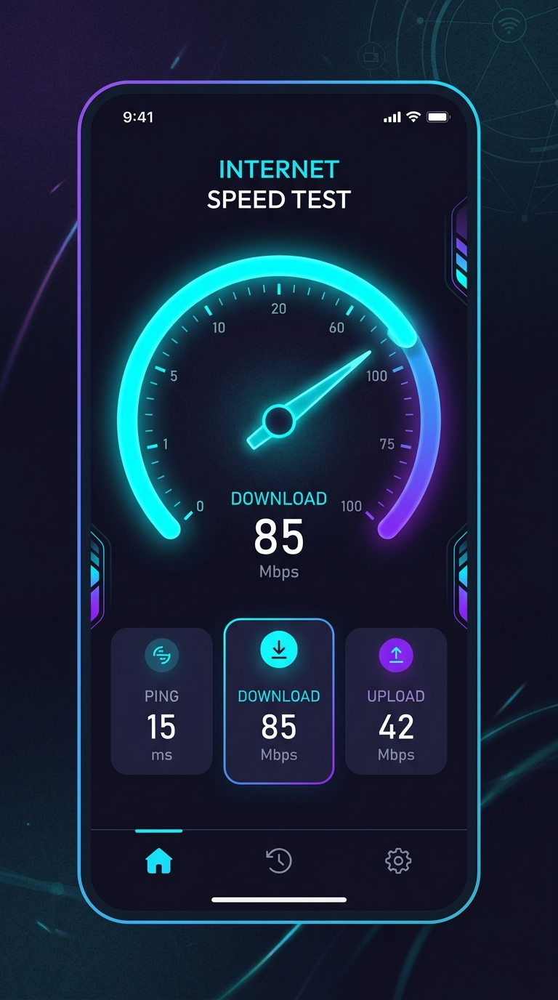
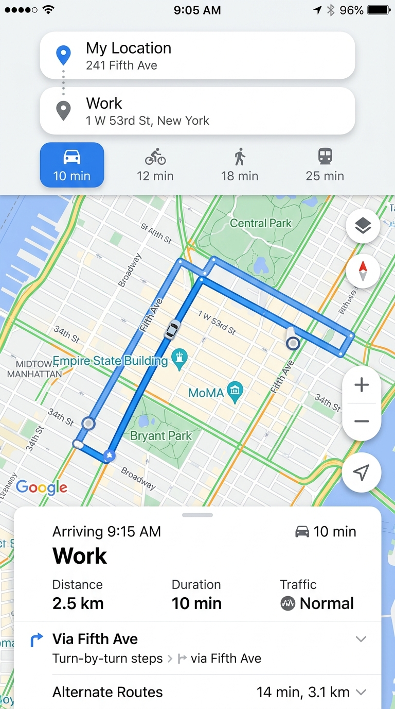
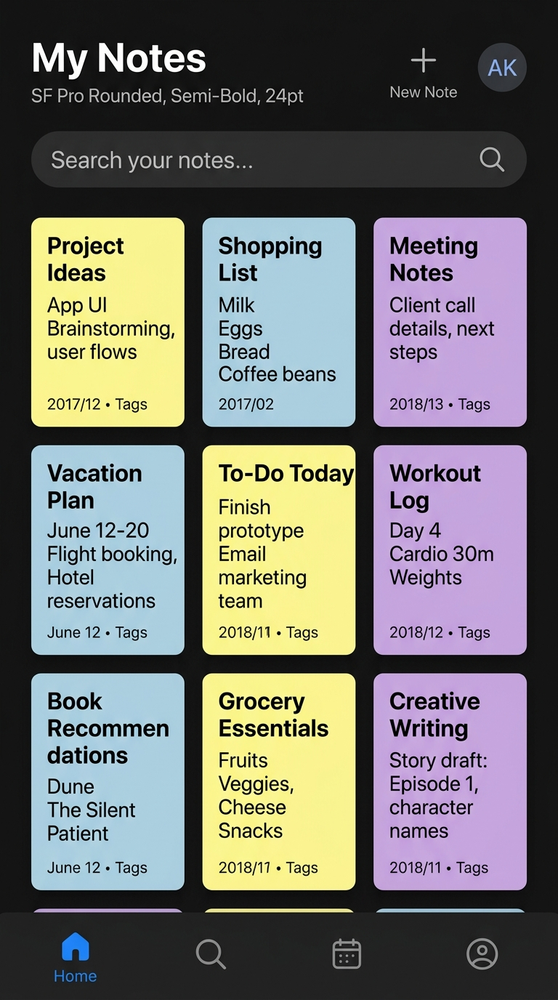
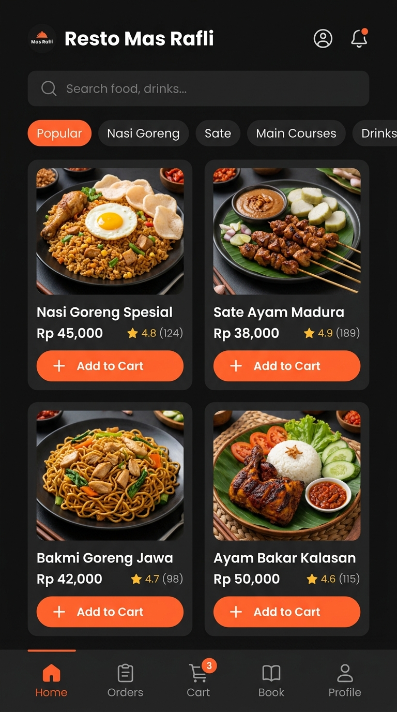

# 📂 Repositori Tugas & Proyek Pemrograman Mobile - Semester 6

Selamat datang di repositori dokumentasi tugas praktikum dan proyek **Pemrograman Mobile (Android)** Semester 6.

## 👤 Identitas Mahasiswa
* **Nama Lengkap:** Muhammad Rafli Adyatma
* **NIM:** 23083000157
* **Program Studi:** S-1 Sistem Informasi
* **Kelas:** Pemrograman Mobile (Semester 6)
* **Institusi:** Universitas Merdeka Malang

---

## 🛠️ Stack Teknologi & Konsep Utama
Seluruh proyek dalam repositori ini dibangun menggunakan standar pengembangan Android modern:
* **Bahasa Pemrograman:** Kotlin
* **UI Toolkit:** Jetpack Compose (Material Design 3)
* **Arsitektur Aplikasi:** MVVM (Model-View-ViewModel) & Repository Pattern
* **Manajemen Jaringan (API):** Retrofit & OkHttp (Open-Meteo, Google Maps API)
* **Penyimpanan Lokal:** SharedPreferences & In-Memory State Management (StateFlow)
* **Peta & Geokodifikasi:** Google Maps SDK for Android, Google Directions API, Google Places Autocomplete API
* **Pustaka Pendukung:** Gson (Serialisasi JSON), Google Maps Compose Utility (Polyline Decoding)

---

## 📂 Struktur & Deskripsi Detail Folder Tugas

Berikut adalah rincian lengkap mengenai fungsi, fitur, berkas utama, serta snapshot antarmuka dari masing-masing folder tugas:

### 1. 🟢 `Week1_HelloWorld`
* 📖 **Deskripsi Detail:** Aplikasi Android paling awal untuk memahami dasar arsitektur Jetpack Compose. Proyek ini membuang paradigma lama XML layout dan sepenuhnya beralih ke UI deklaratif berbasis Kotlin.
* 🚀 **Fitur Utama:**
  * Menampilkan teks "Hello Android!" menggunakan komponen Text dasar Compose.
  * Preview UI dinamis langsung dari IDE Android Studio tanpa memerlukan booting emulator/perangkat fisik.
* 💻 **Tech Stack & Konsep:** `@Composable`, `@Preview`, `Scaffold` layout, `ComponentActivity`, Material 3 Typography.
* 📦 **Struktur & Berkas Penting:**
  * Modul Sumber: [MainActivity.kt](file:///E:/Lainnya/Tugas/Semester%206/Pemrograman%20Mobile/Project/23083000157_Muhammad_Rafli_Adyatma_PemrogramanMobile/Week1_HelloWorld/app/src/main/java/com/example/week1_helloworld/MainActivity.kt)
  * Package Name: `com.example.week1_helloworld`

---

### 2. 👤 `Week2_ProfilMahasiswa`
* 📖 **Deskripsi Detail:** Aplikasi portofolio profil mahasiswa interaktif. Fokus tugas ini adalah memahami penyusunan elemen grafis dasar dan bagaimana UI bereaksi terhadap perubahan data (State Management).
* 🚀 **Fitur Utama:**
  * **Foto Profil & Status:** Foto lingkaran yang ditumpuk dengan lencana (badge) hijau aktif menggunakan layout Box.
  * **Informasi Kontak:** Menampilkan detail kontak (Email, Telepon, Alamat) dalam kartu surface.
  * **Statistik Akademik:** Menampilkan data IPK (3.75), SKS (120), dan Semester (6) secara terstruktur dalam 3 kolom seimbang menggunakan Modifier Weight.
  * **Interaksi State:** Tombol "Edit Profil" yang melacak jumlah penekanan tombol dan merubah warna kontainer tombol dari biru menjadi merah saat mode edit aktif.
* 💻 **Tech Stack & Konsep:** Layout `Column`, `Row`, `Box`, `Modifier` chaining, `remember { mutableStateOf(...) }` (Reactive State), `Card`, `Button`.
* 📦 **Struktur & Berkas Penting:**
  * Alur Utama: [MainActivity.kt](file:///E:/Lainnya/Tugas/Semester%206/Pemrograman%20Mobile/Project/23083000157_Muhammad_Rafli_Adyatma_PemrogramanMobile/Week2_ProfilMahasiswa/app/src/main/java/com/example/profilmahasiswa/MainActivity.kt)
  * Antarmuka Utama: [ProfileScreen.kt](file:///E:/Lainnya/Tugas/Semester%206/Pemrograman%20Mobile/Project/23083000157_Muhammad_Rafli_Adyatma_PemrogramanMobile/Week2_ProfilMahasiswa/app/src/main/java/com/example/profilmahasiswa/screens/ProfileScreen.kt)
  * Package Name: `com.example.profilmahasiswa`
* 📸 **Snapshot Antarmuka:**
  

---

### 3. 👥 `Week3_DaftarMahasiswa`
* 📖 **Deskripsi Detail:** Aplikasi Portal Mahasiswa yang mempraktikkan pengelolaan list data dinamis dan navigasi multi-halaman. Tugas ini mendemonstrasikan bagaimana parameter dilewatkan antar screen menggunakan NavController.
* 🚀 **Fitur Utama:**
  * **Daftar Mahasiswa Dinamis:** Menggunakan Lazy List untuk merender daftar mahasiswa secara efisien dan memicu inisial huruf besar pada foto profil secara otomatis.
  * **Form Pendaftaran:** Form input data mahasiswa baru yang dilengkapi validasi text field (NIM, Nama, Email, Jurusan).
  * **Halaman Detail:** Berpindah ke detail profil mahasiswa terpilih untuk membaca informasi lengkap ketika salah satu kartu mahasiswa diklik.
* 💻 **Tech Stack & Konsep:** Compose Navigation (`NavHost`, `composable`, `rememberNavController`), `LazyColumn` & `items`, `rememberSaveable`, `OutlinedTextField`, `ExtendedFloatingActionButton`.
* 📦 **Struktur & Berkas Penting:**
  * Kode Navigasi & UI: [MainActivity.kt](file:///E:/Lainnya/Tugas/Semester%206/Pemrograman%20Mobile/Project/23083000157_Muhammad_Rafli_Adyatma_PemrogramanMobile/Week3_DaftarMahasiswa/app/src/main/java/com/example/week3_daftarmahasiswa/MainActivity.kt)
  * Package Name: `com.example.week3_daftarmahasiswa`

---

### 4. 📦 `Week4_InventarisBarang`
* 📖 **Deskripsi Detail:** Aplikasi manajemen stok barang lokal (CRUD) untuk mempraktikkan penyimpanan data semi-permanen pada memori internal HP menggunakan format serialisasi JSON.
* 🚀 **Fitur Utama:**
  * **Operasi CRUD:** Mendukung operasi Tambah, Detail, Edit/Update, dan Hapus stok barang.
  * **Penyimpanan Persisten:** Menggunakan shared preferences sehingga data barang tidak hilang saat aplikasi ditutup atau dimatikan.
  * **Repository Pattern:** Mengisolasi logika akses penyimpanan data dari UI dengan menyusun kelas `BarangRepository`.
* 💻 **Tech Stack & Konsep:** `SharedPreferences`, JSON Serialization via Google `Gson`, Repository Pattern, Navigation Compose.
* 📦 **Struktur & Berkas Penting:**
  * Alur Utama: [MainActivity.kt](file:///E:/Lainnya/Tugas/Semester%206/Pemrograman%20Mobile/Project/23083000157_Muhammad_Rafli_Adyatma_PemrogramanMobile/Week4_InventarisBarang/app/src/main/java/com/example/week4_inventarisbarang/MainActivity.kt)
  * Pengelola Database: [BarangRepository.kt](file:///E:/Lainnya/Tugas/Semester%206/Pemrograman%20Mobile/Project/23083000157_Muhammad_Rafli_Adyatma_PemrogramanMobile/Week4_InventarisBarang/app/src/main/java/com/example/week4_inventarisbarang/data/BarangRepository.kt)
  * Package Name: `com.example.week4_inventarisbarang`

---

### 5. 🌤️ `Week6_WeatherForecast`
* 📖 **Deskripsi Detail:** Aplikasi prakiraan cuaca 7 hari ke depan dengan mengintegrasikan API cuaca dunia secara real-time. Tugas ini menerapkan arsitektur bersih MVVM.
* 🚀 **Fitur Utama:**
  * **Pencarian Kota Terpadu:** Menggunakan API Geocoding Open-Meteo untuk mencari lokasi kota secara fleksibel.
  * **Prakiraan Cuaca 7 Hari:** Menampilkan visualisasi temperatur minimum/maksimum harian, total curah hujan harian, dan probabilitas curah hujan.
  * **Reactive State:** Mengubah tampilan UI secara dinamis (Loading State, Success State, Error State) berdasarkan status pemanggilan API.
* 💻 **Tech Stack & Konsep:** Retrofit, OkHttp, API Open-Meteo (Geocoding & Forecast), `StateFlow`, Coroutines (Asynchronous network calls), ViewModel.
* 📦 **Struktur & Berkas Penting:**
  * Konfigurasi API: [WeatherApiService.kt](file:///E:/Lainnya/Tugas/Semester%206/Pemrograman%20Mobile/Project/23083000157_Muhammad_Rafli_Adyatma_PemrogramanMobile/Week6_WeatherForecast/app/src/main/java/com/example/week6_weatherforecast/data/api/WeatherApiService.kt)
  * ViewModel: [WeatherViewModel.kt](file:///E:/Lainnya/Tugas/Semester%206/Pemrograman%20Mobile/Project/23083000157_Muhammad_Rafli_Adyatma_PemrogramanMobile/Week6_WeatherForecast/app/src/main/java/com/example/week6_weatherforecast/ui/viewmodel/WeatherViewModel.kt)
  * Package Name: `com.example.week6_weatherforecast`
* 📸 **Snapshot Antarmuka:**
  

---

### 6. 📱 `Week7_DeviceInfo`
* 📖 **Deskripsi Detail:** Aplikasi utilitas sistem untuk membaca parameter internal perangkat keras (hardware) dan sistem operasi Android secara real-time.
* 🚀 **Fitur Utama:**
  * **Spesifikasi Hardware:** Membaca kapasitas RAM total & sisa, memori internal total & bebas, ukuran diagonal layar, resolusi kamera utama (Megapiksel), serta merk dan tipe HP.
  * **Spesifikasi OS:** Versi Android, SDK API level, patch keamanan Android, versi bootloader, versi kernel Linux, dan Build ID.
  * **Runtime Permission:** Meminta izin akses Kamera secara dinamis menggunakan launcher hasil aktivitas saat aplikasi pertama kali dibuka.
  * **Tab Layout Swipeable:** Menggunakan pager horizontal modern yang bisa digeser untuk berpindah antara kategori Device dan System.
* 💻 **Tech Stack & Konsep:** `android.os.Build` API, `ActivityForResultContracts.RequestPermission` (Runtime Permission), `HorizontalPager` & `SecondaryTabRow`.
* 📦 **Struktur & Berkas Penting:**
  * Alur Utama: [MainActivity.kt](file:///E:/Lainnya/Tugas/Semester%206/Pemrograman%20Mobile/Project/23083000157_Muhammad_Rafli_Adyatma_PemrogramanMobile/Week7_DeviceInfo/app/src/main/java/com/example/week8_deviceinfo/MainActivity.kt)
  * Layar Hardware: [DeviceInfoScreen.kt](file:///E:/Lainnya/Tugas/Semester%206/Pemrograman%20Mobile/Project/23083000157_Muhammad_Rafli_Adyatma_PemrogramanMobile/Week7_DeviceInfo/app/src/main/java/com/example/week8_deviceinfo/ui/screen/DeviceInfoScreen.kt)
  * Layar OS: [SystemInfoScreen.kt](file:///E:/Lainnya/Tugas/Semester%206/Pemrograman%20Mobile/Project/23083000157_Muhammad_Rafli_Adyatma_PemrogramanMobile/Week7_DeviceInfo/app/src/main/java/com/example/week8_deviceinfo/ui/screen/SystemInfoScreen.kt)
  * Package Name: `com.example.week8_deviceinfo` *(Catatan: penamaan paket bermismatch menggunakan week8 di folder tugas Week7)*

---

### 7. ⚡ `Week8_SpeedTestApps`
* 📖 **Deskripsi Detail:** Aplikasi penguji kecepatan koneksi internet (Speed Test) yang melakukan koneksi jaringan riil dengan server Cloudflare untuk mengukur performa unduh, unggah, dan latensi.
* 🚀 **Fitur Utama:**
  * **Latensi PING:** Menguji latensi jaringan dengan melakukan ping ke `google.com` (atau fallback via HTTP HEAD).
  * **Uji Kecepatan Unduh:** Mengunduh berkas biner 10MB dari CDN Cloudflare secara asynchronous dan menghitung kecepatan transfer data dalam Mbps.
  * **Uji Kecepatan Unggah:** Melakukan POST request data biner sebesar 5MB ke Cloudflare secara asynchronous dan menghitung kecepatan upload.
  * **Visual Speed Gauge:** Indikator jarum speedometer dinamis yang berputar sesuai dengan fluktuasi kecepatan internet secara real-time yang digambar di atas canvas.
* 💻 **Tech Stack & Konsep:** `HttpURLConnection`, Kotlin Coroutines `Flow` untuk streaming progres, `Runtime.getRuntime().exec` (command ping), Custom Drawing Canvas.
* 📦 **Struktur & Berkas Penting:**
  * Layar Utama: [SpeedTestScreen.kt](file:///E:/Lainnya/Tugas/Semester%206/Pemrograman%20Mobile/Project/23083000157_Muhammad_Rafli_Adyatma_PemrogramanMobile/Week8_SpeedTestApps/app/src/main/java/com/example/week9_speedtestapps/ui/screen/SpeedTestScreen.kt)
  * Logika Penguji: [SpeedTestManager.kt](file:///E:/Lainnya/Tugas/Semester%206/Pemrograman%20Mobile/Project/23083000157_Muhammad_Rafli_Adyatma_PemrogramanMobile/Week8_SpeedTestApps/app/src/main/java/com/example/week9_speedtestapps/data/SpeedTestManager.kt)
  * Package Name: `com.example.week9_speedtestapps` *(Catatan: penamaan paket menggunakan week9)*
* 📸 **Snapshot Antarmuka:**
  

---

### 8. 🗺️ `Week9_Map`
* 📖 **Deskripsi Detail:** Aplikasi pemetaan dasar yang mengintegrasikan Google Maps SDK for Android untuk menempatkan titik lokasi koordinat di peta dan menggambar jalur rute.
* 🚀 **Fitur Utama:**
  * **Integrasi SDK Google Maps:** Memuat peta Google Maps lengkap dengan fitur zoom, pan, dan kontrol UI bawaan.
  * **Marker Geografis:** Memplot 2 marker penting yaitu Universitas Merdeka Malang (UNMER Malang) sebagai titik asal dan Balai Kota Malang sebagai titik tujuan.
  * **Menggambar Polyline:** Memanggil Google Directions API, melakukan decoding polyline rute jalanan perkotaan, dan menggambarnya di atas peta dengan garis biru berketebalan 10f.
* 💻 **Tech Stack & Konsep:** Google Maps Android SDK, Google Directions API, Retrofit Client, Google Maps Compose Utility (`PolyUtil.decode`).
* 📦 **Struktur & Berkas Penting:**
  * UI Peta: [MapScreen.kt](file:///E:/Lainnya/Tugas/Semester%206/Pemrograman%20Mobile/Project/23083000157_Muhammad_Rafli_Adyatma_PemrogramanMobile/Week9_Map/app/src/main/java/com/rs/mymap/ui/MapScreen.kt)
  * Entry Point: [MainActivity.kt](file:///E:/Lainnya/Tugas/Semester%206/Pemrograman%20Mobile/Project/23083000157_Muhammad_Rafli_Adyatma_PemrogramanMobile/Week9_Map/app/src/main/java/com/rs/mymap/MainActivity.kt)
  * Package Name: `com.rs.mymap` (Theme: `com.example.week10_map`)

---

### 9. 🧭 `Week10_MapDirection`
* 📖 **Deskripsi Detail:** Aplikasi peta dan navigasi tingkat lanjut (advanced) yang merupakan versi lanjutan dari Week 9. Dilengkapi pencarian nama tempat dinamis dan pemilihan rute.
* 🚀 **Fitur Utama:**
  * **Pencarian Autocomplete:** Mencari lokasi asal dan tujuan menggunakan prediksi nama tempat otomatis dari Google Places API secara interaktif.
  * **Moda Transportasi:** Memilih rute berdasarkan moda transportasi: Mengemudi (Driving), Bersepeda (Bicycling), atau Berjalan Kaki (Walking).
  * **Daftar Rute Alternatif:** Bottom sheet interaktif yang menyajikan rute alternatif beserta waktu tempuh dan jarak tempuh terperinci.
  * **Animasi Kamera Peta:** Kamera bergeser secara halus (smooth zoom & pan) menuju rute yang dipilih.
* 💻 **Tech Stack & Konsep:** Google Places Autocomplete & Place Details API, Google Directions API, `ExposedDropdownMenuBox`, `ModalBottomSheet`, `FilterChip` UI, `cameraPositionState.animate()`.
* 📦 **Struktur & Berkas Penting:**
  * Layar Utama & Logika: [MapScreen.kt](file:///E:/Lainnya/Tugas/Semester%206/Pemrograman%20Mobile/Project/23083000157_Muhammad_Rafli_Adyatma_PemrogramanMobile/Week10_MapDirection/app/src/main/java/com/rs/mymap/ui/MapScreen.kt)
  * Package Name: `com.rs.mymap` (Theme: `com.example.week10_mapdirection`)
* 📸 **Snapshot Antarmuka:**
  

---

### 10. 📝 `Week12_MyNoteApp`
* 📖 **Deskripsi Detail:** Aplikasi produktivitas untuk membuat catatan (Notes) dengan pengelolaan status in-memory yang responsif menggunakan StateFlow.
* 🚀 **Fitur Utama:**
  * **Dashboard Notes:** Menampilkan seluruh catatan dalam layout grid modern dengan pencarian dan filter chip.
  * **Note Editor:** Form penulisan catatan dengan validasi teks kosong.
  * **Automatic Sorting:** Catatan otomatis diurutkan di bagian paling atas berdasarkan waktu pembaruan terakhir (`updatedAt`).
  * **Manajemen Catatan:** Dukungan penuh untuk menambah, mengedit, dan menghapus catatan.
* 💻 **Tech Stack & Konsep:** `MutableStateFlow` & `StateFlow` (Reactive State), ViewModel Architecture, Compose Lazy Grid, Navigation Graph.
* 📦 **Struktur & Berkas Penting:**
  * Logika Catatan: [NoteViewModel.kt](file:///E:/Lainnya/Tugas/Semester%206/Pemrograman%20Mobile/Project/23083000157_Muhammad_Rafli_Adyatma_PemrogramanMobile/Week12_MyNoteApp/app/src/main/java/com/example/week12_mynoteapp/viewmodel/NoteViewModel.kt)
  * Entry Point: [MainActivity.kt](file:///E:/Lainnya/Tugas/Semester%206/Pemrograman%20Mobile/Project/23083000157_Muhammad_Rafli_Adyatma_PemrogramanMobile/Week12_MyNoteApp/app/src/main/java/com/example/week12_mynoteapp/MainActivity.kt)
  * Package Name: `com.example.week12_mynoteapp`
* 📸 **Snapshot Antarmuka:**
  

---

### 11. 🗂️ `PraktikumNavigationDrawer`
* 📖 **Deskripsi Detail:** Aplikasi dasar untuk mengimplementasikan menu navigasi laci samping (Navigation Drawer) yang umum digunakan pada aplikasi Android berskala besar dengan banyak modul halaman.
* 🚀 **Fitur Utama:**
  * **Drawer Laci Samping:** Menarik layar dari kiri ke kanan (atau menekan ikon burger) untuk membuka panel navigasi.
  * **Header Profil:** Menampilkan foto profil, nama pengguna (Muhammad Rafli Adyatma), dan email di bagian atas drawer.
  * **Item Navigasi:** Memiliki 4 opsi navigasi: Menu Utama (Home), Screen 1, Screen 2, dan Screen 3.
* 💻 **Tech Stack & Konsep:** `ModalNavigationDrawer`, `DrawerState`, `ModalDrawerSheet`, `NavigationDrawerItem`, Scaffold.
* 📦 **Struktur & Berkas Penting:**
  * Rutas Navigasi: [NavigationRoutes.kt](file:///E:/Lainnya/Tugas/Semester%206/Pemrograman%20Mobile/Project/23083000157_Muhammad_Rafli_Adyatma_PemrogramanMobile/PraktikumNavigationDrawer/app/src/main/java/com/example/praktikumnavigationdrawer/ui/navigation/NavigationRoutes.kt)
  * Entry Point: [MainActivity.kt](file:///E:/Lainnya/Tugas/Semester%206/Pemrograman%20Mobile/Project/23083000157_Muhammad_Rafli_Adyatma_PemrogramanMobile/PraktikumNavigationDrawer/app/src/main/java/com/example/praktikumnavigationdrawer/MainActivity.kt)
  * Package Name: `com.example.praktikumnavigationdrawer`

---

### 12. 🍔 `UTS_RestoMasRafli`
* 📖 **Deskripsi Detail:** Aplikasi pemesanan makanan dan minuman Resto Mas Rafli. Proyek ini menyatukan berbagai konsep seperti database preferensi lokal, keranjang belanja global, transisi UI, dan navigasi bawah.
* 🚀 **Fitur Utama:**
  * **Splash Screen:** Halaman pembuka dengan animasi transisi yang mulus ke Beranda.
  * **Home Screen (Beranda):** Menyambut pengguna, menampilkan spanduk promo Resto, pintasan ke menu, dan fitur **Toggle Dark/Light Mode** yang tersimpan di preferensi.
  * **Menu Katalog:** Daftar kuliner lengkap dengan tabs kategori (Makanan, Minuman, Makanan Ringan) serta filter pencarian cepat.
  * **Detail Menu:** Informasi lengkap seputar komposisi bahan makanan, harga, rating, deskripsi, dan kontrol kuantitas sebelum ditambahkan ke keranjang belanja.
  * **Keranjang Belanja (Pesanan):** Menampilkan daftar item belanjaan secara dinamis, menghitung subtotal belanjaan secara real-time beserta kalkulasi pajak PPN (10%), diskon khusus, dan total pembayaran. Item juga bisa ditambah/dikurangi jumlahnya atau dihapus.
  * **Profil & Edit Profil:** Mengelola biodata pribadi mahasiswa (Nama, NIM, Foto Profil, Bio) yang terhubung langsung ke media penyimpanan `SharedPreferences`.
  * **Bottom Navigation dengan Badge Dinamis:** Navigasi bawah modern yang secara dinamis memunculkan badge notifikasi jumlah item di keranjang belanja.
* 💻 **Tech Stack & Konsep:** Jetpack Compose, Global State Management (`cartItemsState`), SharedPreferences (Data profil & preferensi Dark Mode), Custom Theme, Navigation Compose (State preservation).
* 📦 **Struktur & Berkas Penting:**
  * Alur Utama: [MainActivity.kt](file:///E:/Lainnya/Tugas/Semester%206/Pemrograman%20Mobile/Project/23083000157_Muhammad_Rafli_Adyatma_PemrogramanMobile/UTS_RestoMasRafli/app/src/main/java/com/example/restomasrafli/MainActivity.kt)
  * Package Name: `com.example.restomasrafli`
* 📸 **Snapshot Antarmuka:**
  

---

## 🚀 Cara Menjalankan Proyek
1. Clone repositori ini ke komputer lokal Anda.
2. Buka salah satu folder tugas (misal: `UTS_RestoMasRafli`) menggunakan **Android Studio (Koala/Ladybug atau yang lebih baru)**.
3. Tunggu hingga proses **Gradle Sync** selesai secara otomatis.
4. Hubungkan perangkat Android fisik (via USB Debugging/Wireless Debugging) atau gunakan Emulator.
5. Tekan tombol **Run (Shift + F10)** untuk memasang dan menjalankan aplikasi di perangkat Anda.
