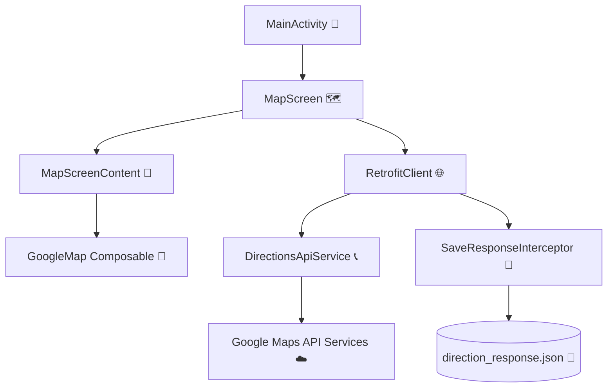

# 🗺️ Week 10 - Map Direction (MyMapRS)

<p align="center">
  
  
  
  
</p>

Aplikasi Android Native berbasis **Jetpack Compose** dan **Kotlin** yang mengintegrasikan Google Maps SDK, Google Places Autocomplete API, dan Google Directions API untuk menghitung rute, memperkirakan waktu tempuh, dan menyarankan rute alternatif secara dinamis.

Proyek ini dibuat untuk tugas kuliah **Pemrograman Mobile** (Week 10).

---

## 🚀 Fitur Utama Aplikasi

Aplikasi dirancang dengan antarmuka modern yang ramah pengguna berbasis **Material Design 3**, menampilkan panel masukan semi-transparan, visualisasi rute interaktif, dan panel detail rute bawah (*Bottom Sheet*).

### 1. 🗺️ Peta Interaktif (Google Maps Compose)
* 🌐 **Peta Layar Penuh**: Memanfaatkan [GoogleMap](file:///E:/Lainnya/Tugas/Semester%206/Pemrograman%20Mobile/Project/Week10_MapDirection/app/src/main/java/com/rs/mymap/ui/MapScreen.kt#L298-L320) Composable dengan kontrol zoom bawaan yang dinonaktifkan demi kebersihan tampilan (*clean UI*).
* 📍 **Penanda Titik Kustom (Markers)**:
  * 🔵 **Titik Asal (Origin)**: Marker khusus berwarna biru (*Azure HUE*).
  * 🔴 **Titik Tujuan (Destination)**: Marker standar berwarna merah.
* 〰️ **Garis Rute (Polyline)**: Jalur perjalanan digambar secara dinamis dengan warna biru Google (`#1A73E8`) dan ketebalan garis sebesar `12f` agar kontras dan mudah dilihat di atas peta.

### 2. 🔍 Panel Masukan & Autocomplete Pencarian Lokasi
* ✍️ **Pencarian Real-Time (Autocomplete)**: Setiap kali pengguna mengetik nama tempat (minimal 3 karakter), aplikasi akan memanggil Google Places Autocomplete API secara asinkronus menggunakan *Retrofit* dan menampilkan saran dropdown menu yang menarik.
* 🌎 **Pengubah Tempat Otomatis (Geocoding)**: Saat pengguna memilih salah satu saran dari dropdown autocomplete, aplikasi akan memanggil Google Place Details API untuk mengambil koordinat garis lintang dan bujur (latitude & longitude) lokasi tersebut dan langsung mengarahkan kamera peta ke titik terpilih.
* ⌨️ **Masukan Koordinat Manual**: Pengguna juga dapat memasukkan koordinat berupa `latitude, longitude` secara manual langsung ke dalam kolom teks input.

### 3. 🚗 Pilihan Moda Transportasi (Travel Modes)
Aplikasi mendukung filter chip transportasi yang terletak di bagian atas panel pencarian dengan ikon representatif:
* 🚗 **Mengemudi (Driving)**: Mengkalkulasi rute jalan raya umum (mobil/motor).
* 🚶 **Berjalan Kaki (Walking)**: Mengkalkulasi jalur pejalan kaki terdekat.
* 🚴 **Bersepeda (Bicycling)**: Mengkalkulasi rute ramah sepeda.
* *Ketika moda transportasi dipilih, aplikasi akan secara otomatis memicu pencarian ulang rute dengan parameter transportasi yang baru.*

### 4. 🔀 Sistem Deteksi Rute Alternatif & Navigasi Dinamis
* 📊 **Pencarian Multi-Rute**: Google Directions API dipanggil dengan parameter `alternatives=true`. Jika tersedia beberapa opsi jalur alternatif, aplikasi akan menangkap semua opsi tersebut.
* 📋 **Pilihan Rute Alternatif (Modal Bottom Sheet)**: Panel bawah yang dapat ditarik (*Modal Bottom Sheet*) menampilkan daftar rute yang tersedia beserta ringkasan nama jalan utama (misal: "via Jl. Magelang"), estimasi waktu tempuh, dan jarak dalam kilometer.
* 🖱️ **Peralihan Rute Interaktif**: Mengklik salah satu rute alternatif pada daftar akan memperbarui garis *polyline* di peta, memperbarui estimasi jarak/waktu secara instan, dan memfokuskan kamera peta ke titik awal rute tersebut.

### 5. 💾 Penyimpanan File Respons JSON (SaveResponseInterceptor)
* 🛠️ Untuk keperluan analisis data atau debugging luring (*offline*), aplikasi memiliki sebuah OkHttp Interceptor khusus bernama `SaveResponseInterceptor`.
* 📂 Setiap kali ada permintaan rute yang berhasil (*successful HTTP response*), interceptor ini akan berjalan di thread latar belakang (`Dispatchers.IO`) untuk menyalin isi badan respons (*response body*) dan menyimpannya ke dalam direktori file internal aplikasi (`context.filesDir`) dengan nama berkas `direction_response.json`.

---

## 🛠️ Arsitektur Kode & Komponen Utama

Proyek ini memisahkan kekhawatiran (*separation of concerns*) dengan baik ke dalam beberapa modul kelas:



### 📂 Detail File & Kode Sumber

* 📱 **[MainActivity.kt](file:///E:/Lainnya/Tugas/Semester%206/Pemrograman%20Mobile/Project/Week10_MapDirection/app/src/main/java/com/rs/mymap/MainActivity.kt)**
  * Entry point aplikasi yang mengaktifkan rendering layar penuh (*edge-to-edge*) dan memuat `MapScreen()` di dalam wadah MaterialTheme.
* 🗺️ **[MapScreen.kt](file:///E:/Lainnya/Tugas/Semester%206/Pemrograman%20Mobile/Project/Week10_MapDirection/app/src/main/java/com/rs/mymap/ui/MapScreen.kt)**
  * **State & Logic (`MapScreen`)**: Mengelola state input teks, daftar rute, indeks rute aktif, titik koordinat, visualisasi pemuatan (*loading state*), visibilitas Bottom Sheet, dan siklus coroutine untuk panggilan API.
  * **Visual Representation (`MapScreenContent`)**: Bagian stateless UI yang merender `GoogleMap`, marker, polyline, chip filter, dropdown autocomplete, tombol "Cari Rute", kartu ringkasan di bawah layar, serta bottom sheet alternatif rute.
* 📞 **[DirectionsApiService.kt](file:///E:/Lainnya/Tugas/Semester%206/Pemrograman%20Mobile/Project/Week10_MapDirection/app/src/main/java/com/rs/mymap/data/api/DirectionsApiService.kt)**
  * interface Retrofit untuk tiga endpoint Google API:
    * `maps/api/directions/json`: Untuk mencari rute perjalanan.
    * `maps/api/place/autocomplete/json`: Untuk memberikan saran pencarian tempat secara dinamis.
    * `maps/api/place/details/json`: Untuk memetakan detail ID tempat menjadi koordinat nyata.
* 💾 **[SaveResponseInterceptor.kt](file:///E:/Lainnya/Tugas/Semester%206/Pemrograman%20Mobile/Project/Week10_MapDirection/app/src/main/java/com/rs/mymap/data/api/SaveResponseInterceptor.kt)**
  * Kelas interceptor OkHttp yang bertugas mencegat respons sukses API dan menyimpannya secara asinkron ke file `direction_response.json` di dalam penyimpanan internal aplikasi.
* 📄 **[DirectionsResponse.kt](file:///E:/Lainnya/Tugas/Semester%206/Pemrograman%20Mobile/Project/Week10_MapDirection/app/src/main/java/com/rs/mymap/data/model/DirectionsResponse.kt) & [PlaceModels.kt](file:///E:/Lainnya/Tugas/Semester%206/Pemrograman%20Mobile/Project/Week10_MapDirection/app/src/main/java/com/rs/mymap/data/model/PlaceModels.kt)**
  * Kumpulan Data Class Kotlin dengan anotasi Gson `@SerializedName` untuk memetakan payload respons JSON dari server Google ke dalam objek Kotlin.

---

## ⚙️ Cara Menjalankan Project

### 1. 📋 Prasyarat (*Prerequisites*)
* 💻 Android Studio (Ladybug atau yang lebih baru).
* ☕ JDK 17 atau JDK 21.
* 📱 SDK Platform Android dengan level API minimal 26 (Android 8.0).

### 2. 🔑 Memasang Google Maps API Key
Untuk mencoba fitur pencarian dan rute secara langsung, pastikan API Key Google Cloud yang valid terpasang:
1. API Key dikonfigurasi di file **[strings.xml](file:///E:/Lainnya/Tugas/Semester%206/Pemrograman%20Mobile/Project/Week10_MapDirection/app/src/main/res/values/strings.xml)**:
   ```xml
   <string name="google_maps_key">MASUKKAN_API_KEY_ANDA</string>
   ```
2. API Key juga dideklarasikan di variabel `apiKey` dalam berkas **[MapScreen.kt](file:///E:/Lainnya/Tugas/Semester%206/Pemrograman%20Mobile/Project/Week10_MapDirection/app/src/main/java/com/rs/mymap/ui/MapScreen.kt)**:
   ```kotlin
   val apiKey = "MASUKKAN_API_KEY_ANDA"
   ```

### 3. 🎯 Pengujian Default
Saat pertama kali dijalankan, aplikasi akan secara otomatis memicu rute default Malang:
* 📍 **Asal**: Universitas Merdeka Malang (`-7.9729917, 112.6093472`)
* 🏁 **Tujuan**: Balai Kota Malang (`-7.9776606, 112.6340866`)
* ✍️ Anda dapat mengetik lokasi baru pada input text box, lalu klik tombol **"Cari Rute"** untuk memperbarui tampilan rute di peta.
* 🔄 Klik tombol **🔄 (Reset)** pada pojok kanan atas kartu input untuk mengembalikan rute ke koordinat default.
* 🗂️ Klik kartu ringkasan jarak/durasi di bawah layar atau tombol FAB bulat di pojok kanan bawah untuk membuka kembali pilihan rute alternatif.

---

## 📦 Spesifikasi Pustaka (Version Catalog)

Detail dependensi penting dalam berkas [libs.versions.toml](file:///E:/Lainnya/Tugas/Semester%206/Pemrograman%20Mobile/Project/Week10_MapDirection/gradle/libs.versions.toml):
* **Android Gradle Plugin (AGP)**: `9.1.1`
* **Kotlin**: `2.2.10`
* **Compose BOM**: `2026.02.01`
* **Maps Compose**: `8.3.0`
* **Google Play Services Maps**: `19.0.0`
* **Android Maps Utils**: `4.5.0`
* **Retrofit**: `2.11.0`
