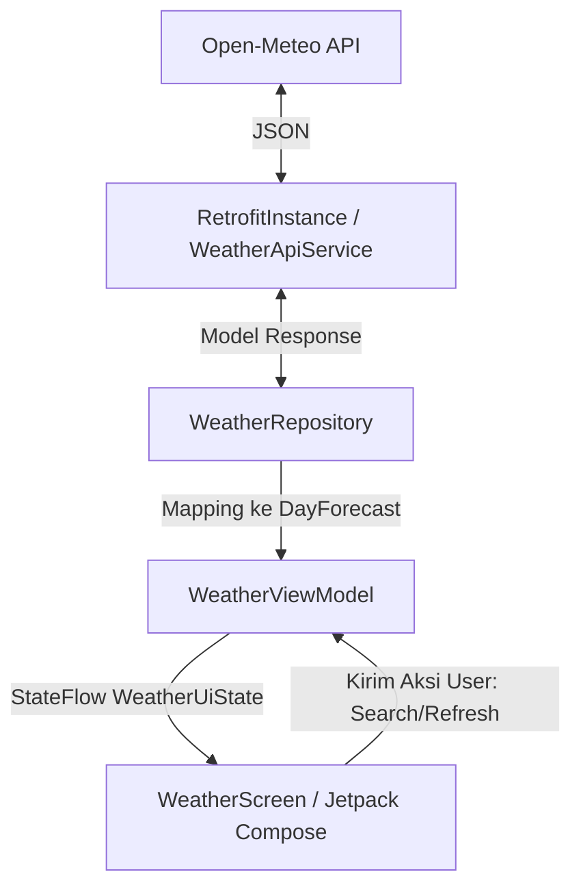

# 🌤️ Weather Forecast App - Week 6 (Pemrograman Mobile)

<p align="left">
  
  
  
  
  
</p>

Aplikasi Prakiraan Cuaca berbasis Android modern yang dibangun menggunakan **Jetpack Compose**, **Kotlin**, dan arsitektur **MVVM (Model-View-ViewModel)**. Aplikasi ini memanfaatkan **Open-Meteo API** untuk mencari lokasi (Geocoding) dan mendapatkan prakiraan cuaca 7 hari secara real-time.

Aplikasi ini didesain dengan antarmuka yang bersih, responsif, dan dinamis menggunakan prinsip-prinsip **Material 3 Design**.


---

## 🚀 Fitur Utama & Detail Implementasi

Berikut adalah daftar lengkap fitur yang telah diimplementasikan dalam aplikasi ini:

### 1. 🔍 Pencarian Kota Real-Time & Saran Dropdown (Autocomplete)
* **Pencarian Pintar**: Pengguna cukup mengetik nama kota (minimal 3 karakter). Aplikasi akan mengirimkan permintaan ke Geocoding API secara asinkron.
* **Dropdown Suggestions**: Menampilkan daftar saran hasil pencarian kota secara instan di bawah search bar dalam bentuk kartu melayang (*Popup Card*).
* **Detail Informasi Lokasi**: Setiap saran menampilkan nama kota beserta provinsi/wilayah (*admin1*) dan negaranya (contoh: *Malang, East Java, Indonesia*).
* **Indikator Loading Integratif**: Menampilkan `CircularProgressIndicator` kecil di dalam kolom pencarian saat proses pencarian saran sedang berlangsung.
* **Tombol Bersihkan**: Terdapat tombol "X" (*Clear*) yang dinamis untuk menghapus teks pencarian dengan satu ketukan.

### 2. 📅 Prakiraan Cuaca 7 Hari Detail
Menampilkan ramalan cuaca terperinci selama 7 hari ke depan dengan detail:
* **Suhu Maksimum & Minimum**: Ditampilkan dengan format rounded integer dan simbol derajat yang jelas (contoh: `30° / 22°`).
* **Probabilitas Hujan (Precipitation Probability)**: Ditampilkan dalam bentuk persentase (%) lengkap dengan ikon payung (`Umbrella`).
* **Kondisi Cuaca Dinamis**: Secara otomatis menentukan status kondisi cuaca berdasarkan probabilitas presipitasi:
  * ⛈️ **Stormy** (Probabilitas > 60%): Menggunakan ikon `Thunderstorm` dengan warna Indigo.
  * ☁️ **Cloudy / Rain** (Probabilitas 21% - 60%): Menggunakan ikon `Cloud` dengan warna Blue Grey.
  * ☀️ **Sunny** (Probabilitas <= 20%): Menggunakan ikon `WbSunny` dengan warna Amber.
* **Indikator Kemajuan Visual**: Dilengkapi dengan `LinearProgressIndicator` di bawah setiap kartu untuk merepresentasikan probabilitas hujan secara visual. Indikator berubah warna menjadi Ungu/Indigo jika probabilitas di atas 50%.

### 3. 💎 Pengalaman Pengguna (UX) Modern & Responsif
* **Highlight Hari Ini (Today)**: Kartu cuaca untuk hari ini diberi warna latar belakang khusus (`primaryContainer` dengan transparansi) dan elevasi yang lebih tinggi (4.dp) agar langsung menarik perhatian pengguna.
* **Pull-to-Refresh**: Mendukung gestur tarik ke bawah (*swipe down*) menggunakan M3 `PullToRefreshBox` untuk menyegarkan data cuaca kota aktif secara real-time.
* **Efek Shimmer Loading**: Animasi loading skeleton berbasis gradien linier yang halus saat data sedang dimuat dari API, memberikan feedback visual premium sebelum konten muncul.
* **Latar Belakang Gradasi**: Memakai gradasi warna vertikal yang lembut dari `primaryContainer` (dengan alpha 0.3f) ke warna `surface` dasar.
* **Lokasi Aktif pada Header**: Header aplikasi secara dinamis menampilkan nama kota dan negara lokasi cuaca yang sedang dilihat lengkap dengan pin lokasi.

### 4. 🛡️ Penanganan Error & Mode Offline
* **Tampilan Error Kustom**: Jika terjadi kegagalan jaringan (offline) atau kota tidak ditemukan, aplikasi menampilkan layar error yang bersahabat dengan ikon `CloudOff`.
* **Mekanisme Coba Lagi (Retry)**: Menyediakan tombol "Try Again" yang akan mencoba memuat ulang pencarian kota sebelumnya secara otomatis.
* **Lokasi Default**: Aplikasi secara otomatis memuat data cuaca kota **Malang** pada saat pertama kali dijalankan sebagai fallback.

---

## 🛠️ Tech Stack & Library

* **Bahasa**: [Kotlin 2.0.x](https://kotlinlang.org/) - Bahasa utama pemrograman modern Android.
* **UI Framework**: [Jetpack Compose (Material Design 3)](https://developer.android.com/compose) - Toolkit UI deklaratif modern.
* **Asynchronous & Concurrency**: Kotlin Coroutines & Flow (menggunakan StateFlow untuk manajemen state reaktif).
* **Networking**:
  * [Retrofit 2](https://square.github.io/retrofit/) - Type-safe HTTP client untuk Android.
  * [Gson Converter](https://github.com/google/gson) - Konversi JSON dari API menjadi objek Kotlin secara otomatis.
* **Arsitektur**: Clean Architecture / MVVM (Model-View-ViewModel) Pattern.
* **Dependency Management**: Version Catalog (`libs.versions.toml`).

---

## 📂 Struktur Proyek & Detail File

Proyek ini dirancang secara terstruktur dengan pemisahan tanggung jawab yang jelas sesuai pola MVVM:

```text
com.example.week6_weatherforecast/
│
├── data/
│   ├── api/
│   │   ├── RetrofitInstance.kt    # Singleton penyedia instance Retrofit dengan GsonConverter.
│   │   └── WeatherApiService.kt   # Kontrak Retrofit mendefinisikan query, endpoint Geocoding, & Forecast.
│   ├── model/
│   │   ├── GeocodingResponse.kt   # Model data response dari API Geocoding (nama, koordinat, negara, dll).
│   │   └── WeatherResponse.kt     # Model data response cuaca harian dan model UI internal (DayForecast).
│   └── repository/
│       └── WeatherRepository.kt   # Penghubung data layer dengan ViewModel, menangani mapping data harian.
│
├── ui/
│   ├── screen/
│   │   └── WeatherScreen.kt       # Layar utama (Compose View) berisi Layout, Card, Shimmer, & ErrorView.
│   ├── state/
│   │   └── WeatherUiState.kt      # State UI terpadu (menyimpan state loading, forecasts, selectedCity, error).
│   ├── theme/                     # Konfigurasi M3 Theme (Color.kt, Theme.kt, Type.kt).
│   └── viewmodel/
│       └── WeatherViewModel.kt    # Logic bisnis pencarian, autocomplete, flow state, dan pull-to-refresh.
│
└── MainActivity.kt                # Titik masuk aplikasi, menginisialisasi dependensi secara manual.
```

### Diagram Arsitektur & Aliran Data


---

## 🌐 API Reference & Parameter

Aplikasi menggunakan API gratis tanpa API Key dari **Open-Meteo**:

1. **Geocoding API (`https://geocoding-api.open-meteo.com/v1/search`)**
   * Digunakan untuk mengonversi nama kota menjadi koordinat latitude & longitude.
   * Parameter yang dikonfigurasi: `name` (query pencarian), `count` (10 untuk dropdown autocomplete, 1 untuk pencarian langsung), `language=id`, dan `format=json`.

2. **Forecast API (`https://api.open-meteo.com/v1/forecast`)**
   * Digunakan untuk mengambil prakiraan cuaca 7 hari berdasarkan koordinat latitude & longitude.
   * Parameter harian yang diambil (`daily`): `temperature_2m_max`, `temperature_2m_min`, `precipitation_sum`, `precipitation_probability_max`.
   * Parameter pendukung: `timezone=Asia/Bangkok` (WIB) dan `forecast_days=7`.

---

## 📥 Prasyarat & Instalasi

### 1. Prasyarat Sistem
* **Android Studio** Ladybug | 2024.2.1 atau versi terbaru.
* **JDK 17** atau yang lebih baru.
* **Gradle** versi terbaru yang sudah terintegrasi.
* Koneksi internet aktif untuk download dependensi dan pengambilan data API.
* Emulator atau perangkat Android fisik dengan **Min SDK 26 (Android 8.0 Oreo)** ke atas.

### 2. Cara Menjalankan Aplikasi
1. **Clone repositori** ini ke komputer lokal Anda:
   ```bash
   git clone https://github.com/username/Week6_WeatherForecast.git
   ```
2. Buka **Android Studio** dan pilih **Open Project**. Arahkan ke folder proyek ini.
3. Tunggu hingga proses **Gradle Sync** selesai secara otomatis.
4. Pastikan perangkat Anda terhubung (jika fisik, aktifkan *USB Debugging*) atau jalankan emulator.
5. Tekan tombol **Run (Shift + F10)** atau klik ikon play hijau di Android Studio.

---

## 📝 Catatan Tugas (Pemrograman Mobile)
Aplikasi ini dibuat khusus untuk memenuhi tugas pekan ke-6 mata kuliah Pemrograman Mobile. Untuk menjaga kesederhanaan tugas dan memfokuskan implementasi pada Jetpack Compose dan MVVM, **Dependency Injection (DI)** dilakukan secara manual melalui constructor injection di `MainActivity.kt` tanpa menggunakan framework external seperti Dagger-Hilt.
