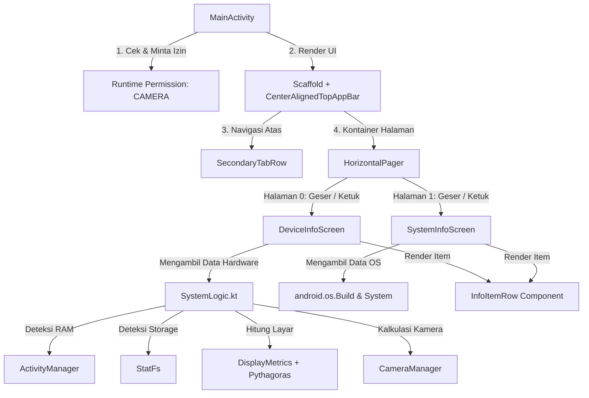

# 📱 Week 8 - Device & System Info Application

[](https://kotlinlang.org)
[](https://developer.android.com/jetpack/compose)
[](https://developer.android.com/about/dashboards)
[](https://developer.android.com/about/versions/15)
[](https://gradle.org)

Aplikasi Android modern yang dikembangkan menggunakan **Kotlin** dan **Jetpack Compose (Material 3)** untuk menampilkan informasi perangkat keras (hardware) dan sistem operasi (software) dari perangkat pengguna secara real-time. Proyek ini dibuat untuk memenuhi tugas mata kuliah **Pemrograman Mobile** (Semester 6).

Aplikasi ini menyajikan visualisasi data sistem perangkat yang bersih, dinamis, dan terstruktur dengan navigasi modern berbasis *tab* serta dukungan gesture geser (*swipe*).

---

## 🚀 Fitur Utama & Detail Informasi

Aplikasi ini dibagi menjadi dua modul informasi utama yang dapat diakses dengan mudah:

### 1. Hardware Information (Tab Device)
Menampilkan spesifikasi fisik dan perangkat keras perangkat secara akurat:
*   **RAM (Total / Sisa)**: 
    *   **Deskripsi**: Menunjukkan kapasitas RAM total perangkat keras serta sisa RAM yang saat ini sedang tidak digunakan.
    *   **Format**: GigaByte (GB) dengan presisi 2 desimal (Contoh: `7.52 GB / 3.12 GB`).
*   **Penyimpanan Internal (Storage)**: 
    *   **Deskripsi**: Menampilkan kapasitas total media penyimpanan internal perangkat dan sisa ruang penyimpanan yang masih kosong.
    *   **Format**: GigaByte (GB) dengan presisi 2 desimal (Contoh: `128.00 GB / 45.30 GB`).
*   **Ukuran Layar**: 
    *   **Deskripsi**: Estimasi ukuran diagonal layar fisik perangkat yang dihitung secara matematis.
    *   **Format**: Inci dengan presisi 1 desimal (Contoh: `6.5 Inci`).
*   **Kamera Belakang**: 
    *   **Deskripsi**: Resolusi sensor kamera utama bagian belakang perangkat. Fitur ini memerlukan izin akses kamera agar dapat membaca resolusi sensor secara akurat.
    *   **Format**: Megapixel (MP) (Contoh: `12.0 MP` atau `48.3 MP`).
*   **Model Perangkat**: 
    *   **Deskripsi**: Menampilkan nama pabrikan (manufacturer) beserta nomor model perangkat resmi.
    *   **Format**: `[MANUFACTURER] [MODEL]` (Contoh: `Xiaomi Redmi Note 10 Pro`).

### 2. System Information (Tab System)
Menampilkan detail sistem operasi dan konfigurasi perangkat lunak (build):
*   **Android Version**: Versi sistem operasi Android yang sedang berjalan (Contoh: `13`, `14`).
*   **SDK Level**: API level dari Android OS yang terpasang pada perangkat (Contoh: `33` untuk Android 13).
*   **Security Patch**: Tanggal rilis patch pembaruan keamanan Android terakhir yang terpasang pada perangkat (Contoh: `2024-05-01`).
*   **Bootloader**: Versi bootloader yang terpasang pada perangkat keras.
*   **Kernel Version**: Versi kernel Linux yang menjalankan dasar sistem Android tersebut.
*   **Build ID**: Kode unik penanda build ROM/OS sistem yang terpasang pada perangkat.

---

## 🛠️ Logika Bisnis & Perhitungan Teknis

Data yang ditampilkan oleh aplikasi ini tidak sekadar hardcoded, melainkan diambil secara dinamis dari API sistem Android melalui kelas utilitas di [SystemLogic.kt](file:///E:/Lainnya/Tugas/Semester%206/Pemrograman%20Mobile/Project/Week7_DeviceInfo/app/src/main/java/com/example/week8_deviceinfo/data/SystemLogic.kt):

### 1. Perhitungan Ukuran Layar (Pythagoras)
Ukuran layar didapatkan dengan mengambil dimensi layar riil (piksel) dan kepadatan piksel per inci (DPI) pada sumbu X (`xdpi`) dan sumbu Y (`ydpi`), kemudian dihitung menggunakan teorema Pythagoras:
$$\text{Lebar (Inci)} = \frac{\text{WidthPixels}}{\text{xdpi}}$$
$$\text{Tinggi (Inci)} = \frac{\text{HeightPixels}}{\text{ydpi}}$$
$$\text{Ukuran Layar (Inci)} = \sqrt{\text{Lebar (Inci)}^2 + \text{Tinggi (Inci)}^2}$$

### 2. Kalkulasi Megapixel Kamera
Aplikasi menggunakan `CameraManager` untuk melakukan iterasi terhadap seluruh kamera yang tersedia pada perangkat:
1. Memfilter kamera dengan karakteristik arah lensa menghadap ke belakang (`LENS_FACING_BACK`).
2. Mengambil peta konfigurasi aliran data output (`SCALER_STREAM_CONFIGURATION_MAP`).
3. Mengambil daftar ukuran output untuk format gambar JPEG.
4. Mencari ukuran terbesar (resolusi maksimum), lalu dihitung menjadi Megapixel (MP) dengan rumus:
$$\text{Megapixel} = \frac{\text{Lebar Piksel} \times \text{Tinggi Piksel}}{1.000.000}$$

> [!IMPORTANT]
> Deteksi kamera memerlukan izin runtime `android.permission.CAMERA`. Jika izin ditolak, aplikasi akan menampilkan fallback berupa `N/A`.

### 3. Pengukuran Memori & Penyimpanan
*   **RAM**: Menggunakan `ActivityManager.MemoryInfo` dengan membagi byte memori dengan $1024^3$ untuk mengonversinya ke satuan GigaByte (GB).
*   **Penyimpanan Internal**: Menggunakan kelas `StatFs` pada direktori root penyimpanan internal (`Environment.getDataDirectory()`). Rumusnya adalah:
$$\text{Kapasitas Storage} = \frac{\text{Block Count} \times \text{Block Size}}{1024^3}$$

---

## 📐 Arsitektur & Alur Aplikasi

Aplikasi ini menggunakan pola arsitektur satu aktivitas (*Single Activity Architecture*) dengan Jetpack Compose. Alur pemrosesan data dan UI dapat digambarkan sebagai berikut:



---

## 📁 Struktur Direktori Proyek

Berikut adalah struktur kode sumber penting di dalam proyek ini:

```text
Week7_DeviceInfo/
│
├── app/
│   ├── src/
│   │   └── main/
│   │       ├── java/com/example/week8_deviceinfo/
│   │       │   ├── data/
│   │       │   │   └── SystemLogic.kt              # Logika pengambilan data hardware (RAM, Storage, Layar, Kamera)
│   │       │   │
│   │       │   ├── ui/
│   │       │   │   ├── components/
│   │       │   │   │   └── InfoComponents.kt       # Komponen UI kartu informasi (InfoItemRow) yang reusable
│   │       │   │   │
│   │       │   │   ├── screen/
│   │       │   │   │   ├── DeviceInfoScreen.kt     # Tampilan layar tab Hardware/Device
│   │       │   │   │   └── SystemInfoScreen.kt     # Tampilan layar tab OS/System
│   │       │   │   │
│   │       │   │   └── theme/
│   │       │   │       ├── Color.kt                # Definisi palet warna Material 3
│   │       │   │       ├── Theme.kt                # Setup Tema Aplikasi (Dynamic Color support)
│   │       │   │       └── Type.kt                 # Konfigurasi Tipografi teks
│   │       │   │
│   │       │   └── MainActivity.kt                 # Activity utama, penanganan runtime permission, & Pager tab UI
│   │       │
│   │       └── AndroidManifest.xml                 # Manifes Android (Deklarasi izin CAMERA & spesifikasi aplikasi)
│   │
│   └── build.gradle.kts                            # Dependensi dan konfigurasi build modul aplikasi
│
└── settings.gradle.kts                            # Konfigurasi repositori dan nama root project
```

### Pranala Berkas Kode Sumber Utama:
*   [MainActivity.kt](file:///E:/Lainnya/Tugas/Semester%206/Pemrograman%20Mobile/Project/Week7_DeviceInfo/app/src/main/java/com/example/week8_deviceinfo/MainActivity.kt)
*   [SystemLogic.kt](file:///E:/Lainnya/Tugas/Semester%206/Pemrograman%20Mobile/Project/Week7_DeviceInfo/app/src/main/java/com/example/week8_deviceinfo/data/SystemLogic.kt)
*   [DeviceInfoScreen.kt](file:///E:/Lainnya/Tugas/Semester%206/Pemrograman%20Mobile/Project/Week7_DeviceInfo/app/src/main/java/com/example/week8_deviceinfo/ui/screen/DeviceInfoScreen.kt)
*   [SystemInfoScreen.kt](file:///E:/Lainnya/Tugas/Semester%206/Pemrograman%20Mobile/Project/Week7_DeviceInfo/app/src/main/java/com/example/week8_deviceinfo/ui/screen/SystemInfoScreen.kt)
*   [InfoComponents.kt](file:///E:/Lainnya/Tugas/Semester%206/Pemrograman%20Mobile/Project/Week7_DeviceInfo/app/src/main/java/com/example/week8_deviceinfo/ui/components/InfoComponents.kt)
*   [AndroidManifest.xml](file:///E:/Lainnya/Tugas/Semester%206/Pemrograman%20Mobile/Project/Week7_DeviceInfo/app/src/main/AndroidManifest.xml)

---

## 💻 Spesifikasi Teknologi & Dependensi

*   **Bahasa Utama**: [Kotlin (v1.9+)](https://kotlinlang.org/)
*   **Desain & UI**: [Jetpack Compose (Material 3)](https://developer.android.com/jetpack/compose) dengan dukungan dynamic colors pada Android 12+.
*   **Navigasi**: `HorizontalPager` dari foundation pager Compose untuk gesture swipe.
*   **Minimum Android SDK**: API 26 (Android 8.0 Oreo) - Memastikan kompatibilitas luas dengan perangkat lama.
*   **Target Android SDK**: API 36 (Android 15+) - Mematuhi standar keamanan dan optimasi sistem terbaru.
*   **Build Tool**: Gradle dengan Kotlin DSL (`.gradle.kts`).

---

## ⚙️ Cara Menjalankan Aplikasi

Ikuti langkah-langkah berikut untuk mengompilasi dan menjalankan proyek di Android Studio:

### 1. Persiapan Awal
*   Pastikan Anda telah menginstal **Android Studio** versi terbaru (Disarankan **Ladybug 2024.2.1** atau yang lebih baru).
*   Pastikan perangkat Android fisik atau Emulator telah terpasang dengan versi minimal **Android 8.0 (API Level 26)**.

### 2. Impor Proyek
1.  Buka Android Studio.
2.  Pilih **File** -> **Open** (atau **Open an Existing Project** pada halaman selamat datang).
3.  Arahkan ke folder proyek ini (`Week7_DeviceInfo`) dan klik **OK**.
4.  Tunggu beberapa saat hingga proses sinkronisasi Gradle (*Gradle Sync*) selesai secara otomatis. Pastikan komputer Anda terhubung ke internet untuk mengunduh dependensi yang diperlukan.

### 3. Menjalankan Aplikasi
1.  Aktifkan fitur **USB Debugging** pada perangkat fisik Android Anda, lalu hubungkan ke komputer menggunakan kabel USB. Atau, jalankan **Android Virtual Device (AVD)** melalui Device Manager di Android Studio.
2.  Pilih perangkat target Anda pada drop-down menu di toolbar bagian atas.
3.  Klik tombol **Run** (ikon segitiga hijau / Play) atau tekan pintasan `Shift + F10` (Windows) / `Control + R` (macOS).
4.  Setelah aplikasi terinstal dan berjalan di perangkat, setujui permintaan **Izin Kamera** saat dialog perizinan runtime muncul agar spesifikasi kamera belakang dapat terbaca secara lengkap.
