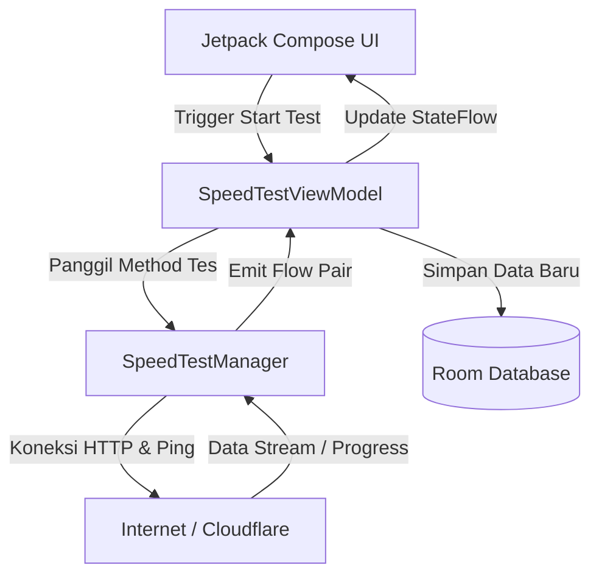

# 🚀 Week9_SpeedTestApps - Aplikasi Pengukur Kecepatan Internet Modern

<div align="center">


</div>

---

Aplikasi Android pengukur kecepatan internet modern yang dirancang secara deklaratif menggunakan **Kotlin**, **Jetpack Compose**, **Material Design 3**, serta didukung oleh **Room Database** untuk pencatatan riwayat pengujian. Aplikasi ini dikembangkan sebagai proyek tugas Pemrograman Mobile (Semester 6).

Aplikasi melakukan pengujian kinerja jaringan secara nyata (real-time) dengan melakukan *handshake/ping* ke Google serta melakukan transmisi data unduh/unggah dari dan ke server edge **Cloudflare Speedtest**.

---

## 📱 Fitur Utama & Detail Implementasi

Aplikasi ini dilengkapi dengan fitur-fitur utama pengujian jaringan yang diimplementasikan secara kokoh dengan detail teknis berikut:

### 1. ⚡ Uji Latensi (Ping Test)
Fitur untuk mengukur waktu respon (latensi) koneksi internet pengguna.
* **🔧 Mekanisme Utama**: Menjalankan proses sistem untuk melakukan perintah `ping -c 3 -W 2 google.com` (mengirimkan 3 paket ICMP dengan batas waktu tunggu 2 detik).
* **🎯 Ekstraksi Data**: Menggunakan Ekspresi Reguler (Regex) dengan pola `time=(\d+\.?\d*)\s*ms` untuk menyaring waktu respons dalam milidetik dari output konsol sistem secara aman.
* **🛡️ Mekanisme Fallback (HTTP HEAD)**: Jika perintah ping sistem tidak diizinkan oleh sistem operasi Android atau gagal dijalankan, aplikasi secara otomatis beralih menggunakan permintaan `HTTP HEAD` ke `https://www.google.com` menggunakan `HttpURLConnection`. Selisih waktu nanodetik (`System.nanoTime()`) sebelum dan sesudah koneksi dihitung sebagai estimasi latensi ping.

### 2. 📥 Uji Kecepatan Unduh (Download Speed Test)
Mengukur kecepatan transfer data masuk (throughput download) dari server terdekat.
* **🌐 Metode Koneksi**: Mengunduh berkas uji biner sebesar **10 Megabytes (10.000.000 bytes)** secara langsung dari server edge Cloudflare melalui endpoint `https://speed.cloudflare.com/__down?bytes=10000000`.
* **🔄 Pemrosesan Asinkron**: Aliran data dibaca menggunakan buffer byte berukuran `8192 bytes` (`8 KB`) di dalam thread latar belakang (`Dispatchers.IO`) untuk menjaga stabilitas UI.
* **📊 Kalkulasi & Pelaporan Real-Time**:
  * Menggunakan **Kotlin Flow** untuk mengirimkan pembaruan berkala setiap **150 ms**.
  * Kecepatan unduh dihitung dalam satuan **Mbps** (Megabits per second):
    $$\text{Kecepatan (Mbps)} = \frac{\text{Byte Terunduh} \times 8}{\text{Waktu Berjalan (detik)} \times 1.000.000}$$
  * Menghitung dan melaporkan persentase progres unduhan secara dinamis untuk menggerakkan indikator visual.

### 3. 📤 Uji Kecepatan Unggah (Upload Speed Test)
Mengukur kecepatan transfer data keluar (throughput upload) ke server cloud.
* **🌐 Metode Koneksi**: Mengunggah data acak kosong berukuran **5 Megabytes (5.000.000 bytes)** menggunakan metode HTTP POST ke endpoint Cloudflare `https://speed.cloudflare.com/__up`.
* **⚡ Optimalisasi Jaringan**: Menggunakan `setFixedLengthStreamingMode(5_000_000)` pada objek `HttpURLConnection` untuk mencegah buffering data di memori internal Android (mencegah `OutOfMemoryError`).
* **📊 Kalkulasi & Pelaporan Real-Time**:
  * Menggunakan buffer berukuran `8192 bytes` untuk mengirimkan data secara bertahap.
  * Seperti uji unduh, data progres dan kecepatan dalam satuan Mbps dipancarkan via **Flow** ke UI setiap **150 ms** untuk memastikan jarum speedometer bergerak dengan halus.

### 4. 🎨 Speedometer Visual Kustom (Interactive Speed Gauge)
Komponen visual speedometer interaktif berbentuk setengah lingkaran melingkar yang dirancang khusus menggunakan **Canvas** Jetpack Compose.
* **📐 Gambar Busur (Arc)**: Menggambar busur background berwarna abu-abu terang dengan `startAngle = 150f` dan `sweepAngle = 240f` dengan ketebalan garis `12.dp` dan ujung bulat (`StrokeCap.Round`).
* **📏 Garis Skala (Ticks)**: Membagi busur menjadi 8 bagian skala dengan menghitung koordinat awal dan akhir garis skala menggunakan fungsi trigonometri (`cos` dan `sin`) berdasarkan sudut radian:
  $$\theta_{\text{rad}} = \text{Math.toRadians}(150^\circ + (i \times \frac{240^\circ}{8}))$$
* **📍 Animasi Jarum (Needle Pointer)**: Jarum penunjuk yang responsif berputar secara dinamis sesuai kecepatan internet saat itu. Pergerakan jarum dirancang mulus menggunakan API `Animatable` Jetpack Compose dengan interpolasi durasi `300 ms` (`tween`).
* **🔢 Tampilan Tengah**: Menampilkan angka kecepatan real-time dengan format numerik bulat tanpa pecahan serta label satuan kecepatan "Mbps" yang kontras.

### 5. 🗄️ Integrasi Room Database (Persistence Layer)
Database lokal SQLite yang dikonfigurasi menggunakan pustaka **Room Database** untuk mendukung perekaman hasil pengujian jaringan secara permanen.
* **📋 Struktur Tabel (`speed_test_history`)**:
  * `id` (`Long`): Primary Key dengan konfigurasi autoincrement.
  * `timestamp` (`Long`): Waktu eksekusi pengujian dalam bentuk epoch milidetik.
  * `downloadSpeed` (`Float`): Hasil akhir kecepatan unduh dalam Mbps.
  * `uploadSpeed` (`Float`): Hasil akhir kecepatan unggah dalam Mbps.
  * `ping` (`Float`): Hasil akhir waktu respon ping dalam ms.
* **💾 Pola Akses Data (DAO - Data Access Object)**:
  * `insertResult(result: SpeedTestEntity)`: Menyimpan riwayat baru hasil uji kecepatan.
  * `getAllHistory()`: Mengambil seluruh riwayat pengujian yang diurutkan berdasarkan waktu terbaru dalam bentuk `Flow<List<SpeedTestEntity>>` agar UI terbarui secara otomatis saat ada data baru.
  * `clearHistory()`: Menghapus seluruh riwayat pengujian dari database.
* **🧩 Singleton Pattern**: Menggunakan pola Singleton untuk instansiasi `AppDatabase` agar menghindari overhead pembuatan koneksi database ganda di memori.

---

## 🛠️ Arsitektur Proyek & Pola Desain (MVVM)

Proyek ini menerapkan arsitektur **MVVM (Model-View-ViewModel)** untuk memisahkan secara tegas logika bisnis, penyimpanan data, kontrol alur kerja, dan representasi antarmuka.

### 🔄 Alur Kerja Transmisi Data


### 📂 Struktur Folder & Penjelasan File
```
Week9_SpeedTestApps/
│
├── app/
│   ├── src/main/
│   │   ├── java/com/example/week9_speedtestapps/
│   │   │   ├── data/
│   │   │   │   ├── AppDatabase.kt      <- Pengaturan Room Database dengan Pola Singleton 🗄️
│   │   │   │   ├── SpeedTestDao.kt     <- Deklarasi query Room (Insert, Select All, Delete) 💾
│   │   │   │   ├── SpeedTestEntity.kt  <- Definisi struktur tabel SQLite 'speed_test_history' 📋
│   │   │   │   └── SpeedTestManager.kt <- Logika inti transmisi data (Ping, Download, Upload) ⚙️
│   │   │   │
│   │   │   ├── model/
│   │   │   │   └── SpeedTestModels.kt  <- Sealed class TestPhase & Data class SpeedTestUiState 📦
│   │   │   │
│   │   │   ├── ui/
│   │   │   │   ├── components/
│   │   │   │   │   ├── ResultCard.kt   <- Kartu informasi visual hasil pengujian (Ping, Download, Upload) 🎴
│   │   │   │   │   └── SpeedGauge.kt   <- Speedometer kustom menggunakan Canvas dan Animatable 🎨
│   │   │   │   ├── screen/
│   │   │   │   │   └── SpeedTestScreen.kt <- Tata letak utama halaman pengujian kecepatan 📱
│   │   │   │   └── theme/
│   │   │   │       ├── Color.kt        <- Definisi palet warna Material Design 3 🎨
│   │   │   │       ├── Theme.kt        <- Pengaturan tema aplikasi (Dark/Light Mode) 🌗
│   │   │   │       └── Type.kt         <- Pengaturan tipografi teks aplikasi 🔤
│   │   │   │
│   │   │   ├── viewmodel/
│   │   │   │   └── SpeedTestViewModel.kt <- Penghubung antara data manager dengan UI state 🔄
│   │   │   │
│   │   │   └── MainActivity.kt         <- Entry point aplikasi (mengaktifkan mode Edge-to-Edge) 🎬
│   │   │
│   │   └── AndroidManifest.xml         <- Deklarasi izin INTERNET & ACCESS_NETWORK_STATE 📜
│   │
│   └── build.gradle.kts
│
├── gradle/
│   └── libs.versions.toml                  <- Katalog dependensi terpusat (Version Catalog) 🛠️
├── build.gradle.kts
└── settings.gradle.kts
```

---

## ⚙️ Spesifikasi & Teknologi

* **☕ Bahasa Pemrograman**: [Kotlin](https://kotlinlang.org/) v1.9+
* **🎨 Framework UI**: [Jetpack Compose](https://developer.android.com/jetpack/compose) dengan **Material Design 3**
* **⚡ Konkurensi & Aliran Data**: [Kotlin Coroutines](https://kotlinlang.org/docs/coroutines-overview.html) & [Kotlin Flow](https://kotlinlang.org/docs/flow.html)
* **🗄️ Penyimpanan Lokal**: [Room Database](https://developer.android.com/training/data-storage/room) v2.6.1 (dengan Google KSP)
* **🌐 Koneksi Jaringan**: Java `HttpURLConnection` & `InputStream` / `OutputStream`
* **📱 Target Android**: Compile & Target SDK 35 (Android 15), Minimum SDK 26 (Android 8.0 Oreo)
* **☕ Versi Java**: Java Development Kit (JDK) 17

---

## 🚀 Cara Menjalankan Proyek

### 1. ⚙️ Prasyarat
* Pasang IDE **Android Studio (Koala | 2024.1.1)** atau yang terbaru.
* JDK 17 telah terkonfigurasi pada Android Studio.
* Pastikan komputer/laptop dan perangkat Android memiliki **koneksi internet aktif** (diperlukan untuk pengujian speedtest riil).

### 2. 🛠️ Langkah Instalasi
1. Clone atau unduh repositori ini ke penyimpanan lokal Anda.
2. Jalankan Android Studio, klik **Open**, lalu pilih folder `Week8_SpeedTestApps`.
3. Tunggu hingga proses sinkronisasi Gradle selesai (*Gradle sync*).
4. Hubungkan perangkat fisik Android melalui kabel USB (pastikan *USB Debugging* aktif) or nyalakan Android Virtual Device (Emulator).
5. Tekan tombol **Run 'app'** (ikon tombol putar hijau di bagian kanan atas toolbar) atau tekan pintasan `Shift + F10` (Windows) / `Control + R` (macOS).

---

## 🔒 Konfigurasi Izin Keamanan

Aplikasi memerlukan akses internet luar untuk dapat melakukan ping dan mengunduh/mengunggah file uji. Izin berikut dideklarasikan dalam file `AndroidManifest.xml`:

```xml
<!-- Izin untuk melakukan koneksi socket dan HTTP -->
<uses-permission android:name="android.permission.INTERNET" />
<!-- Izin untuk memeriksa status koneksi jaringan -->
<uses-permission android:name="android.permission.ACCESS_NETWORK_STATE" />
```

---

## 💡 Tips & Catatan Pengujian
* **⚠️ Konsumsi Kuota**: Setiap kali Anda menekan tombol "Mulai Tes", aplikasi akan mengunduh file 10MB dan mengunggah file 5MB (total sekitar 15MB data internet terpakai). Disarankan untuk menggunakan koneksi Wi-Fi atau pastikan Anda memiliki paket kuota yang cukup selama masa pengujian.
* **🎯 Akurasi Pengujian**: Untuk mendapatkan akurasi pengukuran kecepatan maksimal, disarankan untuk tidak membuka aplikasi lain yang melakukan pengunduhan di latar belakang saat pengujian berlangsung.
