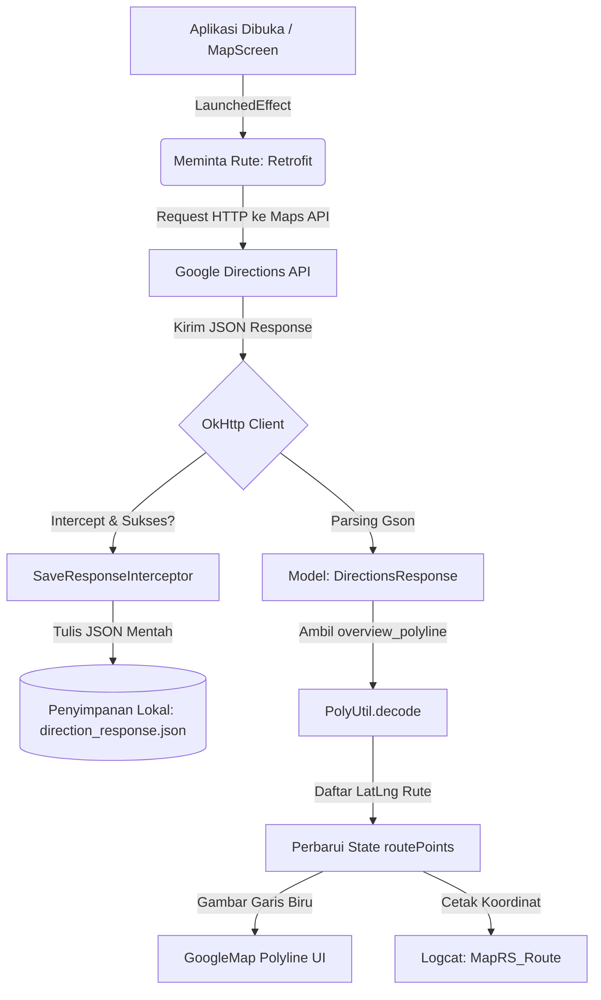

# 🗺️ MyMapRS — Integrasi Google Maps & Google Directions API

<p align="center">
  
  
  
  
  
</p>

---

## 📝 Deskripsi Proyek

Proyek ini adalah aplikasi Android tingkat lanjut yang dibangun menggunakan **Kotlin** dan **Jetpack Compose** untuk memenuhi tugas mata kuliah **Pemrograman Mobile (Semester 6)**. Aplikasi ini mendemonstrasikan integrasi praktis antara **Google Maps SDK** dan **Google Directions API** untuk mengambil, memproses, mendekode, serta memvisualisasikan rute perjalanan secara dinamis antara dua titik lokasi di Kota Malang (Universitas Merdeka Malang menuju Balai Kota Malang).

Aplikasi ini juga dilengkapi fitur penyimpanan data rute lokal menggunakan **OkHttp Interceptor custom** untuk keperluan cache offline dan analisis respons JSON.

---

## 🌟 Fitur Unggulan & Cara Kerjanya secara Detail

### 🗺️ 1. Visualisasi Peta Utama (Google Map Compose)
Aplikasi menampilkan peta Google Maps secara penuh menggunakan komponen `GoogleMap` Jetpack Compose.
* 📍 **Titik Pusat Peta**: Peta secara otomatis diarahkan (*centered*) pada koordinat tengah Kota Malang (`-7.975, 112.622`) dengan tingkat zoom `14f` agar visual rute terlihat jelas.
* ⚙️ **Pengaturan UI Peta**: Mengaktifkan kontrol zoom bawaan (`zoomControlsEnabled = true`) melalui parameter `uiSettings = MapUiSettings(...)`.

### 📍 2. Penanda Lokasi Presisi (Markers)
Aplikasi mendefinisikan dan menandai dua titik lokasi penting di Kota Malang menggunakan pin merah standar Google Maps:
* 🛫 **Titik Asal (Origin)**: Universitas Merdeka Malang (`LatLng(-7.9729917, 112.6093472)`) dengan keterangan "Titik Asal".
* 🛬 **Titik Tujuan (Destination)**: Balai Kota Malang (`LatLng(-7.9776606, 112.6340866)`) dengan keterangan "Titik Tujuan".

### 🌐 3. Komunikasi Jaringan & Konsumsi API (Retrofit)
Melakukan pemanggilan asinkron (*asynchronous networking*) menggunakan **Retrofit 3.0** ke endpoint REST Google Directions API (`https://maps.googleapis.com/maps/api/directions/json`).
* 🔗 Endpoint menerima parameter: `origin` (koordinat asal), `destination` (koordinat tujuan), dan `key` (Google API Key).
* 📦 Data dikonversi secara otomatis dari JSON ke objek Kotlin menggunakan **Gson Converter Factory**.

### 📐 4. Penguraian Jalur Kompresi (Polyline Decoding)
Respons dari Google Directions API memuat data jalur jalan dalam bentuk teks terkompresi (*encoded polyline*) pada field `overview_polyline.points`.
* 🔓 Aplikasi menggunakan **Android Maps Utils** (`PolyUtil.decode(...)`) untuk mendekompresi string terenkripsi tersebut menjadi daftar koordinat lintang & bujur (`List<LatLng>`).
* 🎨 Jalur tersebut digambar di atas peta menggunakan komponen `Polyline` dengan spesifikasi warna **Biru** (`Color.Blue`) dan ketebalan garis **10f** agar terlihat menonjol dan estetis.

### 💾 5. Custom OkHttp Interceptor untuk Penyimpanan Offline
Untuk mengimplementasikan cache respons data API, aplikasi dilengkapi dengan `SaveResponseInterceptor` yang menyaring setiap jaringan HTTP sukses (`200 OK`).
* 📁 Interseptor ini secara asinkron membaca body respons mentah lalu menuliskannya langsung ke file internal penyimpanan privat Android (`context.filesDir/direction_response.json`).
* 💾 Ini sangat berguna agar aplikasi dapat dikembangkan lebih lanjut untuk bekerja secara luring (*offline capability*).

### 📋 6. Logging Koordinat Rute (Debugging)
Seluruh daftar koordinat hasil dekode polyline dicetak ke Logcat Android dengan tag `MapRS_Route`. Anda dapat melacak koordinat jalan secara real-time saat rute berhasil dimuat.

### 💳 7. Floating Bottom Information Card
Di bagian bawah layar peta, terdapat kartu informasi modern (`Card` dengan `elevation = 8.dp`) yang melayang dengan kontras warna Material 3 yang elegan. Kartu ini menampilkan teks petunjuk rute yang sedang dianalisis oleh pengguna.

---

## 📊 Aliran Data & Arsitektur Aplikasi (Data Flow)

Berikut adalah diagram alir kerja aplikasi dari inisiasi UI hingga visualisasi rute dan penyimpanan file lokal:



---

## 📂 Struktur Berkas Kode Sumber

Berikut adalah detail berkas kode sumber utama yang membangun seluruh fitur di atas:

* 📄 **[AndroidManifest.xml](file:///E:/Lainnya/Tugas/Semester%206/Pemrograman%20Mobile/Project/Week9_Map/app/src/main/AndroidManifest.xml)**  
  Mengatur izin dasar aplikasi: `ACCESS_FINE_LOCATION`, `ACCESS_COARSE_LOCATION`, dan `INTERNET`, serta mendeklarasikan Google Maps API Key melalui metadata `<meta-data android:name="com.google.android.geo.API_KEY" .../>`.
   
* 📄 **[MainActivity.kt](file:///E:/Lainnya/Tugas/Semester%206/Pemrograman%20Mobile/Project/Week9_Map/app/src/main/java/com/rs/mymap/MainActivity.kt)**  
  Entry point aplikasi yang mengaktifkan rendering layar penuh (*Edge-to-Edge*) dan memuat komponen UI `MapScreen` di dalam container `Surface`.

* 📄 **[MapScreen.kt](file:///E:/Lainnya/Tugas/Semester%206/Pemrograman%20Mobile/Project/Week9_Map/app/src/main/java/com/rs/mymap/ui/MapScreen.kt)**  
  File logika UI utama yang menggabungkan GoogleMap, penentuan marker asal/tujuan, pemanggilan asinkron Retrofit di dalam coroutine `LaunchedEffect`, dekode polyline, pencatatan log koordinat, serta render Floating Info Card di bagian bawah.

* 📄 **[SaveResponseInterceptor.kt](file:///E:/Lainnya/Tugas/Semester%206/Pemrograman%20Mobile/Project/Week9_Map/app/src/main/java/com/rs/mymap/data/api/SaveResponseInterceptor.kt)**  
  Interseptor kustom OkHttp yang menyalin isi respons jaringan sukses dan menulisnya ke media penyimpanan internal secara sinkron.
  ```kotlin
  val responseBody = response.peekBody(Long.MAX_VALUE)
  val json = responseBody.string()
  saveToFile(json) // Menyimpan ke filesDir/direction_response.json
  ```

* 📄 **[RetrofitClient.kt](file:///E:/Lainnya/Tugas/Semester%206/Pemrograman%20Mobile/Project/Week9_Map/app/src/main/java/com/rs/mymap/data/api/RetrofitClient.kt)**  
  Singleton object yang membangun instance Retrofit menggunakan base URL Google API dan menambahkan `SaveResponseInterceptor` ke dalam konfigurasi `OkHttpClient`.

* 📄 **[DirectionsApiService.kt](file:///E:/Lainnya/Tugas/Semester%206/Pemrograman%20Mobile/Project/Week9_Map/app/src/main/java/com/rs/mymap/data/api/DirectionsApiService.kt)**  
  Interface Retrofit yang memetakan method GET `maps/api/directions/json` dengan parameter query `origin`, `destination`, dan `key`.

* 📄 **[DirectionsResponse.kt](file:///E:/Lainnya/Tugas/Semester%206/Pemrograman%20Mobile/Project/Week9_Map/app/src/main/java/com/rs/mymap/data/DirectionsResponse.kt)**  
  Representasi model data Kotlin untuk menangkap skema balikan JSON dari Google Directions API (khususnya field `routes -> overview_polyline -> points`).

* 📄 **[strings.xml](file:///E:/Lainnya/Tugas/Semester%206/Pemrograman%20Mobile/Project/Week9_Map/app/src/main/res/values/strings.xml)**  
  Tempat konfigurasi penampung nama aplikasi (`MyMapRS`) dan API Key Google Maps.

---

## 🛠️ Dependensi & Teknologi

Proyek ini dikembangkan dengan konfigurasi build Kotlin DSL pada Gradle terbaru:
* **Target & Compile SDK**: `37`
* **Min SDK**: `26`

Detail versi pustaka dalam file **[libs.versions.toml](file:///E:/Lainnya/Tugas/Semester%206/Pemrograman%20Mobile/Project/Week9_Map/gradle/libs.versions.toml)**:
* 🗺️ **Maps Compose**: `8.3.0`
* 🗺️ **Play Services Maps**: `19.0.0`
* 🧮 **Android Maps Utils**: `4.5.0` (digunakan untuk memanggil `PolyUtil.decode`)
* 🌐 **Retrofit / Gson Converter**: `3.0.0`

---

## 🔑 Langkah Pengaturan Kunci API

1. Dapatkan Kunci API dari [Google Cloud Console](https://console.cloud.google.com/).
2. Pastikan Anda mengaktifkan **Maps SDK for Android** dan **Directions API** pada konsol tersebut.
3. Buka file [strings.xml](file:///E:/Lainnya/Tugas/Semester%206/Pemrograman%20Mobile/Project/Week9_Map/app/src/main/res/values/strings.xml) dan ganti nilai berikut:
   ```xml
   <resources>
       <string name="app_name">MyMapRS</string>
       <string name="google_maps_key">MASUKKAN_GOOGLE_MAPS_KEY_ANDA_DISINI</string>
   </resources>
   ```

---

## 🏃 Cara Menjalankan & Menelusuri Fitur (Debugging)

### 🕹️ Menjalankan Aplikasi:
1. Buka Android Studio dan lakukan **Open Project** pada folder `Week9_Map`.
2. Lakukan sinkronisasi Gradle (jika diperlukan).
3. Sambungkan perangkat Android Anda atau nyalakan emulator.
4. Jalankan aplikasi dengan menekan tombol **Run**.

### 🔍 Memeriksa Koordinat di Logcat:
1. Buka tab **Logcat** di bagian bawah Android Studio.
2. Pada kolom pencarian filter, ketik: `MapRS_Route`.
3. Anda akan melihat log koordinat lintang & bujur seperti contoh di bawah ini:
   ```text
   D/MapRS_Route: Point 0: -7.97299, 112.60934
   D/MapRS_Route: Point 1: -7.97341, 112.61011
   D/MapRS_Route: Point 2: -7.97412, 112.61245
   ...
   ```

### 📂 Mengakses Berkas JSON Offline:
1. Buka fitur **Device File Explorer** di sebelah kanan Android Studio.
2. Masuk ke direktori:
   `data` ➡️ `data` ➡️ `com.rs.mymap` ➡️ `files`.
3. Anda akan menemukan file **`direction_response.json`** yang berisi data respons mentah yang didapatkan langsung dari Google Directions API.
